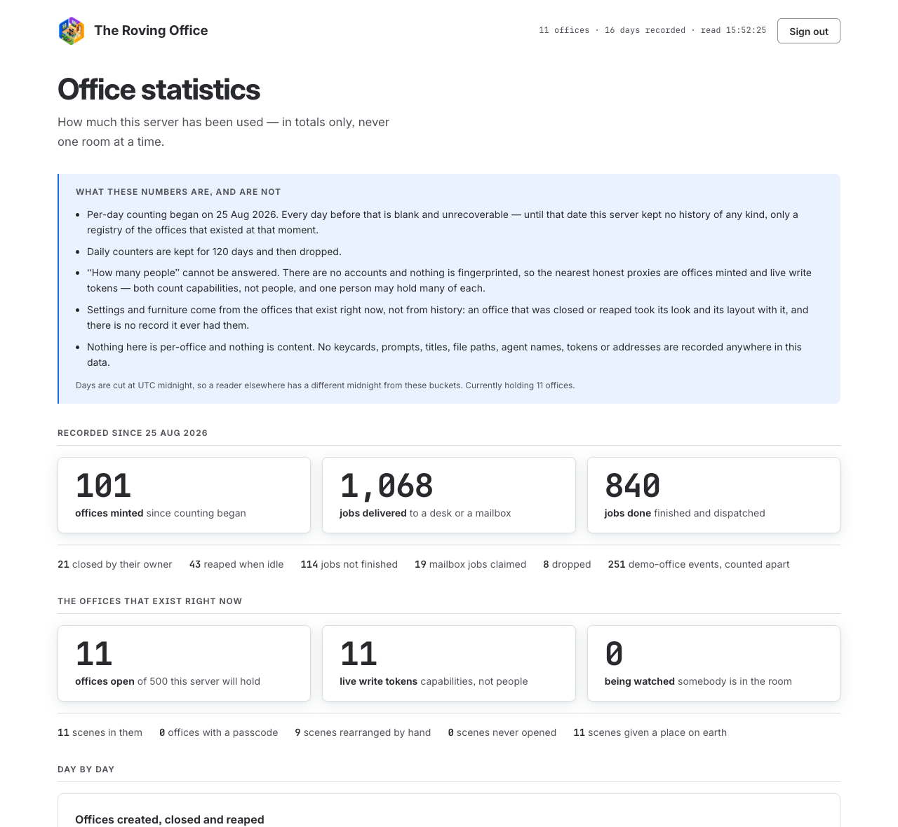

# The admin console

A password-gated page of summary statistics about one deployment: how many offices have
been opened and closed, how many harnesses have successfully connected, how much work has
been delivered and finished, and what people set their rooms to look like.



> **Every number in that picture is invented.** It is a server deliberately seeded with
> fifteen days of made-up counters — including a two-day gap — so that the charts have
> something in them to look at. It is nobody's traffic, and this project has published no
> usage figures. A real instance on its first day shows zeros and a one-day axis, which is
> the honest and much less interesting picture.

The label is in three places on purpose — this caption, the image's alt text, and the
file's own name (`admin-console-sample.png`) — because a screenshot gets copied out of the
page it was captioned in, and the filename is the only one of the three that travels with
it. In a public repository a committed screenshot of invented figures would otherwise read
as real usage.

Note what is at the top of the page: not a number, but the list of what these numbers
cannot tell you. That panel is the most important thing on the console, for the reason
[given below](#what-is-recorded-and-what-cannot-be).

It is an **operator** surface, not a user one. Nothing in it is about an individual
office, and there is deliberately no way to make it be.

```
<your path>                    the console
<your path>/api/session        POST to sign in, DELETE to sign out
<your path>/api/stats          GET the numbers (signed in only)
```

## It does not exist unless you configure it — and that takes two variables

```bash
ROVING_OFFICE_ADMIN_PASSWORD='something long that only you know' \
ROVING_OFFICE_ADMIN_PATH=/a-word-nobody-would-guess \
  npm start
```

Both come from the environment and neither has a default. **Either one missing and every
request that could have reached the console answers 404 with the body `Not found`**,
byte-identical to a missing static file. Not 401: a deployment that has not asked for an
admin surface should not advertise one. The console's own files live in `admin/` and the
static file server refuses that directory outright, so there is no second way to reach
them.

Choose the password as you would any other single credential protecting a whole
deployment. It is not the office passcode: that one guards one room and is short because a
person reads it off a card, while this one guards a whole server's statistics and is typed
from a password manager.

| Variable | Default | What it does |
| --- | --- | --- |
| `ROVING_OFFICE_ADMIN_PASSWORD` | *(none — console absent)* | The password. Environment only. |
| `ROVING_OFFICE_ADMIN_PATH` | *(none — console absent)* | Where it answers. Environment only. |
| `ROVING_OFFICE_ADMIN_PER_CLIENT` | 5 | Wrong passwords one caller may offer per window. |
| `ROVING_OFFICE_ADMIN_PER_SERVER` | 15 | Wrong passwords the server hears from everybody. |
| `ROVING_OFFICE_ADMIN_WINDOW_MS` | 600000 | The window both count over. |

### The path is not a security control

**The password is.** The path's only job is keeping the console out of casual discovery
and out of the bot scans that walk a wordlist of common admin addresses. It survives being
guessed, shoulder-read or found in a log, because everything behind it still needs the
password — so do not let a clever path talk you into a weaker one.

Two things follow from that, and both are deliberate:

- **The path is not written down in this repository, and cannot be.** This code is
  published, so any "obscure" path compiled into the source would be published with it —
  one address, readable out of the tree, shared by every deployment in the world. Only an
  operator's own path is not public knowledge. That is why there is no default rather than
  a default somebody might leave in place.
- **It is not derived from the password**, not even through a hash. A path travels where a
  password must never go: server access logs, browser history, and a `Referer` header on
  any link followed from the page. Anything computed from the secret would be depositing a
  function of it in all three.

A path that is not a path, or one that would shadow the app's own routes (`/office`,
`/api`, `/docs` and the rest), is refused — and refused by **leaving the console absent**
rather than by failing to boot. A mistyped admin path must not be able to stop anybody's
room from loading, and "no console" is the safe direction to fail in. The reason is printed
at start-up; the path itself is printed too, since it is not the secret, and the password
never is.

Only wrong attempts count — a correct one is refunded — so a typo costs nothing once you
get it right. The per-server limit is the one that matters: there is exactly one admin
password, so "this password" and "this server" are the same target, and a caller rotating
a forwarded-for header cannot sidestep it.

Changing either variable and restarting invalidates every signed-in session. That is the
whole of rotation here.

## How it is secured

Everything reuses machinery that was already here rather than introducing a second of
anything:

- **One key derivation.** `deriveKey` in [`lib/office-store.cjs`](../../lib/office-store.cjs)
  is the project's only `scrypt` call site, shared with the per-office passcode. `sameDigest`
  beside it is the only constant-time compare. A secret is never compared with `===`.
- **The existing limiter**, [`lib/rate-limit.cjs`](../../lib/rate-limit.cjs), used exactly
  as the per-office unlock route uses it: two limiters, both spent *before* the KDF runs,
  so an unmetered attempt route cannot become a way to spend the server's CPU.
- **A signed cookie**, on the model of `passcodeSeal`: `HMAC-SHA256` keyed on the password
  digest. No session table, nothing new to persist, and twelve hours rather than the
  office passcode's thirty days.

The salt is a fixed string in the code, and that is correct here rather than an oversight:
a salt defends a *stored* digest against precomputation, and nothing is stored. The
password lives in the process environment and its digest in the process heap, both already
lost to anyone who can read either. What `scrypt` is still doing is making each online
guess expensive, which is the half that pairs with the limiters.

The console's shell is served without a credential and its numbers are not. `console.html`
is a fixed file with no data in it, identical on a server that has recorded a year of
traffic and one that booted a second ago — the same reasoning the office applies to the
app shell behind a passcode. The password form is ordinary client UI reacting to a 401.

Nothing about this touches the front door. `/` and the demo office keep needing no
credential, and no ordinary office becomes harder to open.

## What is recorded, and what cannot be

[`lib/stats-store.cjs`](../../lib/stats-store.cjs) starts a record that never existed
before it. The office registry is a list of what exists *now*; the reaper deletes an idle
office leaving no trace; the AOP bus is a ring buffer that forgets. **So every per-day
number begins at the day the counters were first written and there is no way to backfill a
single day before it.** The console says so on its face, first thing on the page, because
an empty chart that looks complete is worse than one labelled as empty.

What is kept is counters and small per-day buckets:

| Per day | From |
| --- | --- |
| Offices minted, closed, reaped | `onOpen` / `onClose` on the office store |
| Connections per source — distinct offices fed, and event volume | accepted AOP events |
| Jobs delivered, done, unfinished, claimed, dropped | accepted AOP event types |
| Seasons and buildings chosen | a scene `PATCH` carrying a `look` |
| Demo-office events, counted apart | accepted AOP events |

And what cannot be:

- **How many people.** There are no accounts anywhere in this project and nothing is
  fingerprinted. The nearest defensible proxies are offices minted and live write tokens,
  both of which count *capabilities* rather than people, and the console labels them as
  that. It does not present either as a headcount.
- **Anything about the past.** Not for offices closed before recording began, and not for
  the settings or furniture of any office that has since been reaped — that data went with
  the office and was never written down anywhere else.
- **Furniture and settings as history.** Both come from a census of the offices that exist
  right now (`census` in `lib/office-store.cjs`), which is a photograph rather than a
  record. The per-day look counters are the only going-forward version.

### The lines this does not cross

- **No content, ever.** No prompts, titles, summaries, file paths, tool names, agent
  names, URLs, keycards or tokens. Only an event's `type` and its `harness.name` are read,
  and only to decide which counter to add one to.
- **No per-office rows** in any aggregate. "Distinct offices per source per day" is
  counted through an in-memory set that holds `day|source|keycard` until the day rolls and
  is never written to disk. The honest cost is that **a restart re-counts** — an office fed
  both before and after a redeploy counts twice in that day's number — and that is the
  right trade: the alternative is persisting a record of which office used which harness.
- **No new identifiers.** No visitor ids, no client addresses, no hashes of either.
- **The demo office is excluded from every statistic**, and counted separately rather than
  discarded so that the exclusion is visible instead of silent. `/` redirects into that
  room, so its traffic is visitors and tests rather than anybody's usage.

Retention is `RETAIN_DAYS` in `lib/stats-store.cjs`: 120 daily buckets, then dropped. That
is the whole retention rule, and it is the only thing bounding the file — the per-day
bucket is a fixed set of counters, so nothing else in it grows.

## Jobs, in the office's own vocabulary

AOP has no event called "job done"
([the spec](protocol/aop-spec.md), §4.2 and §4.5), so the mapping is written down rather
than guessed at:

| The console says | The events | Why |
| --- | --- | --- |
| Delivered to a desk | `turn.start` | Reduces to `mail` — the paper aeroplane arriving |
| Delivered to the mailbox | `job.queued` | Also `mail`, but work arriving from outside |
| Done | `turn.end` with `status: "completed"` | Reduces to `dispatch` — out through the outbox |
| Not finished | `turn.end`, any other status | `error`, `cancelled` and `blocked` together |

`turn.title` is deliberately not counted. The spec says it renames work in flight and MUST
NOT be read as a new job, and a counter that ignored that would inflate deliveries by
however often harnesses rename their work.

The two deliveries are kept apart rather than added, because a round of work in a session
and a job landing in a mailbox are different things. Very few harnesses emit `job.*` at
all, so the mailbox numbers are expected to be near zero even on a busy server.

## The charts

The console wears the project's shared theme, `assets/ui-theme.css` — the same file
reception, the office and these documentation pages load, so every colour, space, radius
and type size comes from one place and nothing is restated. It deliberately does *not*
import `styles.css`: that file is the office's, and its first rule sets
`overflow: hidden` on `body` for a full-viewport canvas, which is the one thing a long
scrolling page of charts must not inherit. So the few surfaces the console needs —
reception's nav bar, its card, its button, the panels' small-caps headings — are drawn in
`admin/console.css` in the same idiom rather than borrowed wholesale.

The series colours are worth a line, because picking them badly is easy. The job chart
uses the theme's **own status colours**, so a bar means what the room means by it:
`--status-walking` for work carried to a desk, `--status-delivering` for the mailbox,
`--job-done` for finished, `--status-error` for a turn that did not. Harnesses have no
such meaning to borrow, so those are chosen for being told apart in a stack, with two
exceptions that do carry one: Test Data wears the idle grey because it is not real usage,
and an unrecognised harness wears the sun yellow because it is the series an operator
should notice. A warm orange is avoided throughout — it is close enough to Claude's own
brand colour to read as "the Claude bar" on a page that draws a Claude bar.

Hand-authored inline SVG in `admin/console.js`, with **no charting library**. This project
vendors its dependencies and keeps a licence inventory for the open-source release, so a
package would mean new licence evidence, new notices and a new row in
`third-party/inventory.json` — for a handful of bar charts. There is no build step here
either, and the console is served as plain files like everything else.

Two rules run through the drawing, both because these numbers get used to make decisions:

1. **Nothing is interpolated or smoothed.** Bars only. A line between two bars asserts a
   value for the day in between, and there is none.
2. **A day with no recorded events is drawn as an explicit gap mark below the baseline,
   never as a zero.** "Nothing happened" and "we were not running" are different facts.

Days are cut at UTC midnight, which the console states — a reader's own midnight is not
this one, and a day that looks half-empty is usually that.

## Should it ship?

It does, and the reasoning is worth keeping: the only secret is environment-only, so there
is nothing in the repository for the console to leak. A public checkout of this code has no
admin surface until somebody deliberately sets a variable, and a deployment that never sets
one is indistinguishable from a build without the feature. Excluding it via `.exportignore`
would mean the public repository's server had a 404 branch nobody could explain, and the
next contributor would reinvent it worse.

## Looking at it

It is a page, so look at it:

```bash
ROVING_OFFICE_ADMIN_PASSWORD=letmein ROVING_OFFICE_ADMIN_PATH=/back-of-house \
  node server.cjs 8081
```

Then open `http://localhost:8081/back-of-house`. A fresh state directory has nothing in
it, which is itself worth seeing — an empty console should read as "recording started
today", not as a broken page.

It wears the shared theme (`assets/ui-theme.css`), so it should look like a page of this
application and not like a dashboard from somewhere else. If the fonts come out as a
system stack, check the `Content-Security-Policy` in `sendAdminFile`: under
`default-src 'none'` a missing `font-src` blocks the webfonts silently.
