# Buildings and themes

*Eight buildings. One floor plan, and everything else different.*

Every office shares the same floor — the same room dimensions, the same places the desks
can stand — and differs in all the ways you actually notice: the walls, the floor finish,
the light, the way in, and the city outside the windows.

Press **`S`** for the scene panel and change **Building** to move house. The room comes
with you.

**So do your agents.** Changing the building or the season keeps everybody in the office —
their desk assignments, their current jobs, their recent history, and whoever you had
selected. Live feeds keep running. Somebody caught on a staircase or in a lift that the
new building does not have carries on from the new entrance instead.

## The eight

### Alder Street

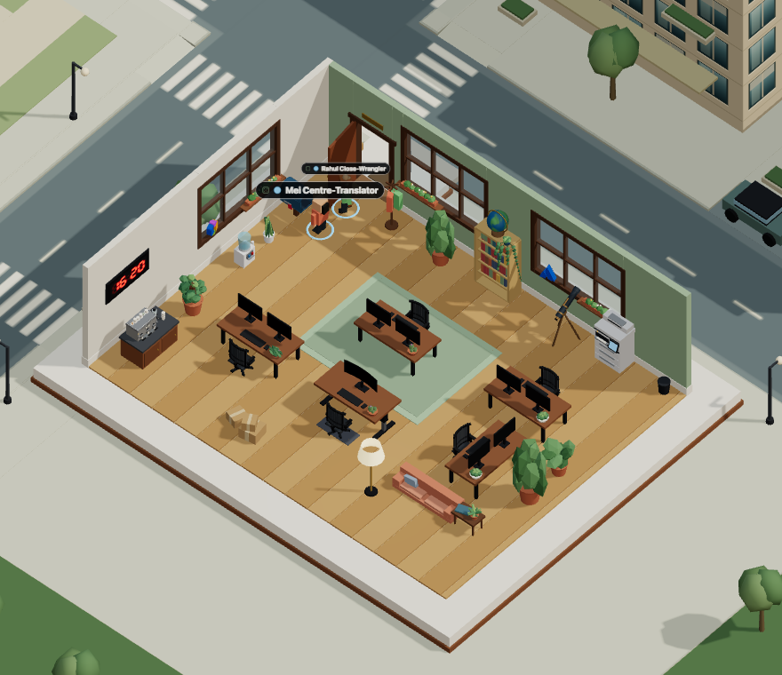

*A brownstone beside a leafy city park.* Ground floor, a **stoop** with steps down to the
pavement, and a park across the road. The plainest of the eight, and the one the office
opens on.

---

### Foundry Loft

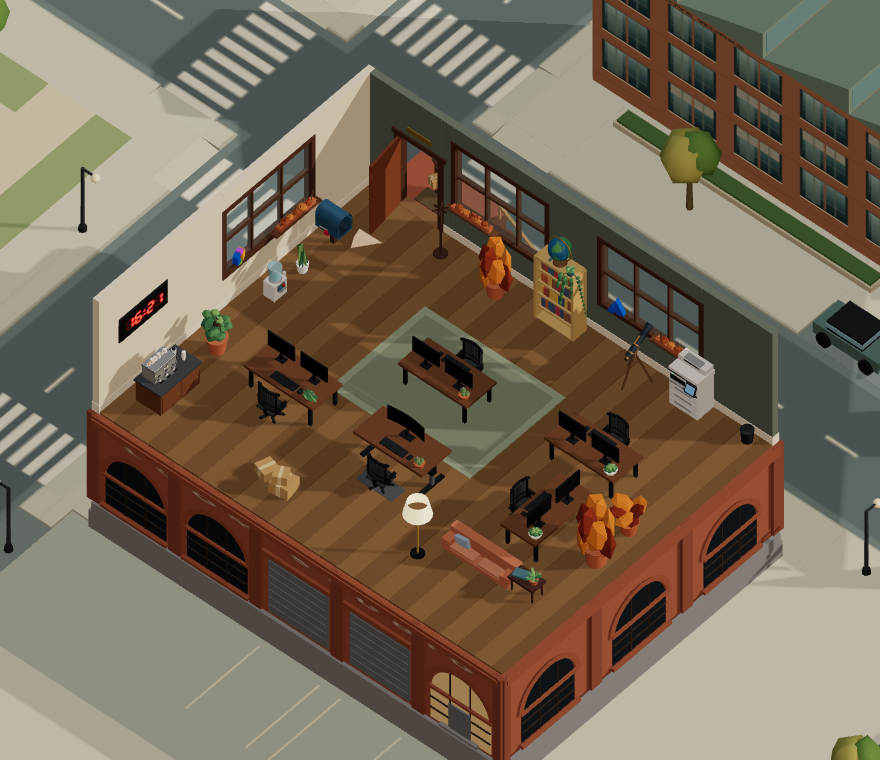

*Brick, timber and industrial character.* Top floor of two, reached by **an external
staircase** run hard against the facade — everything that comes in climbs it, the courier
included. Below is a service yard with loading bays on the bay grid, and a concrete apron
with painted markings.

---

### Rue Dauphine

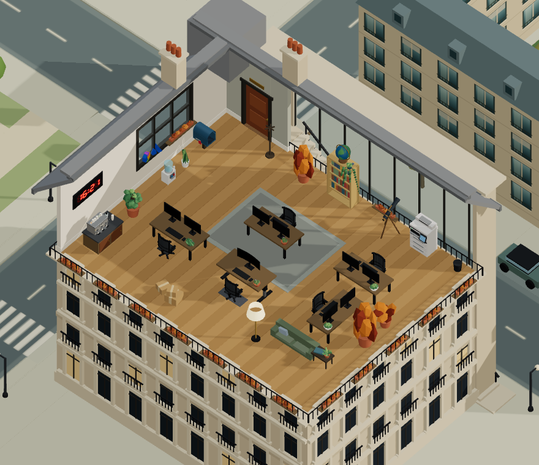

*A Parisian studio above the rooftops.* Top of three, up **a glazed-in stairwell** — two
storeys of bare external stair against limestone reads as a fire escape, so the top of the
back wall goes behind glass. Which is also why **this one's back wall has no windows**, and
therefore no window boxes. A steep mansard roof with chimney stacks standing on it.

---

### Tide Wharf

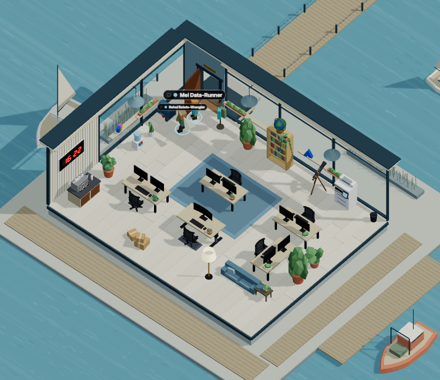

*An airy studio on a working harbour.* A **stoop** onto timber decking, water on three
sides, and a boat moored at the end of the pier.

A low Nordic harbour studio: pale ash boards and dark blue steel framing broad views
across the water. A stone quay and timber deck connect the room to a continuous
waterfront, with coves, docks, moored boats and layers of harbour buildings beyond. Cool
blue daylight makes the interior feel open; warm lamps make it a sheltered place after
dark.

---

### Canopy House

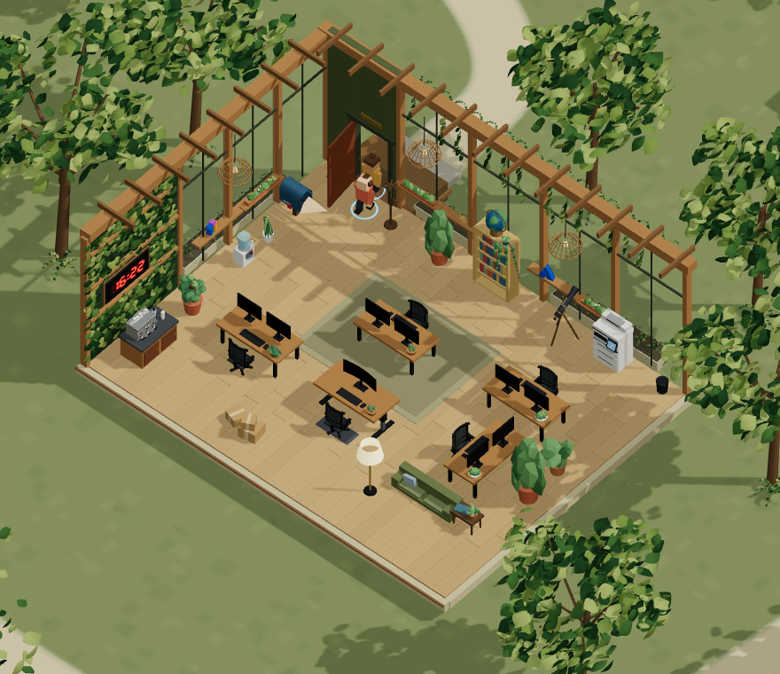

*A light-filled office among the trees.* Ground floor, a **stoop**, and foliage at every
window — the most enclosed outlook of the eight. You are in a garden rather than looking
at one.

A timber-framed garden pavilion. Tall windows wrap two sides of the room with tree
canopies just beyond the glass, and oak floorboards, exposed beams, woven pendant shades
and a planted wall bring the warmth of a conservatory indoors. Ferns fill the window
planters and trailing greenery hangs from the upper ledge. Outside, a winding path leads
from the entrance past a few low neighbouring buildings among the trees.

Move the time towards evening to see the warm interior against the darkening garden.

---

### Kestrel Tower

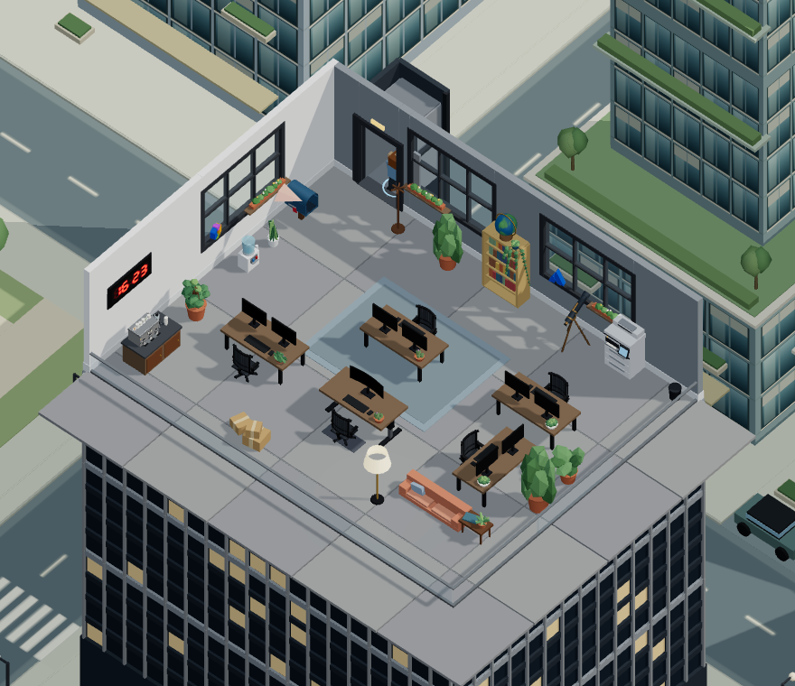

*Glass, sky and gardens above the city.* Level 34, reached by **a lift** on the outside of
the building whose car really travels. Three storeys of curtain wall are modelled below
you, and the neighbouring towers rise *past* eye level over a field of rooftops. There is
no season in its name, because a tower is never on a street.

---

### Lantern Court

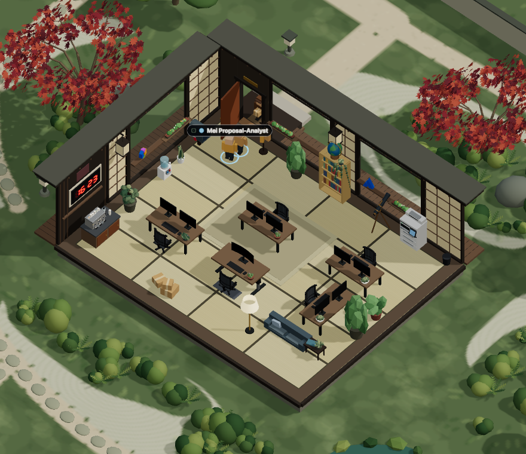

*Dark timber overlooking a Japanese garden.* Ground floor, a **stoop**, and a courtyard
garden of raked gravel and maples.

A low garden pavilion of dark timber, creamy paper screens and carefully framed clear
windows. A pale woven floor and restrained indigo and burgundy accents give the room a
calm, ordered feel. Narrow paths wind through a full garden of moss, ferns, shrubs, pines,
bamboo and seasonal maples, with water and a small footbridge. At night the screens and
lanterns glow against the darker garden — this is the building where the lamps matter
most.

---

### Dune Atelier

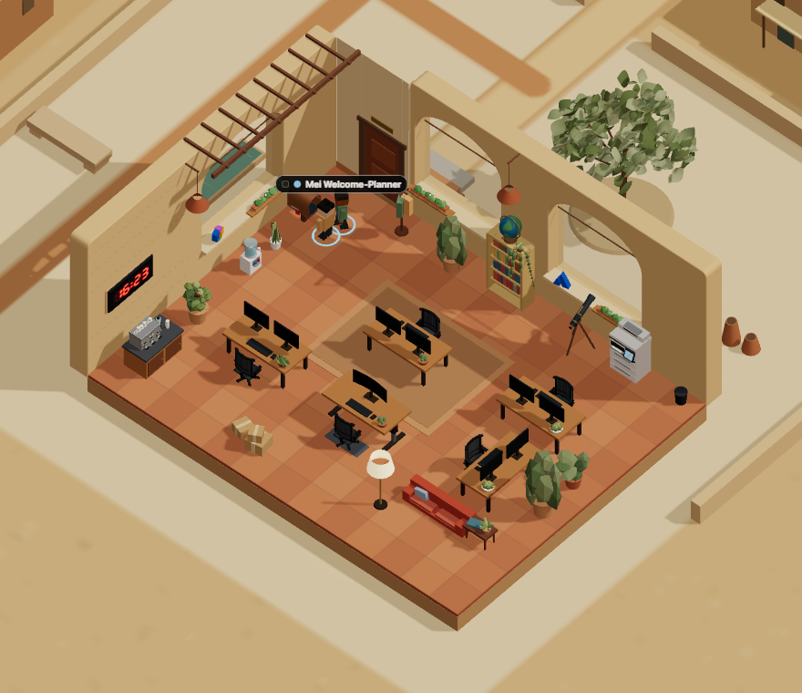

*Earth walls, shaded alleys and desert light.* Ground floor, a **stoop**, and arched
openings cut through thick earth walls.

A sculpted courtyard office with thick sandy walls, deep rounded openings and terracotta
floor tiles. The light falls across broad plaster surfaces and through timber shade
elements — the hardest light of the eight, which is why so much of it is shaded. Outside,
a quiet walled garden holds an olive tree, succulents and a narrow water channel, and the
entrance leads into a low earthen town with shaded alleys, backed by layers of
wind-shaped dunes.

> Every picture on this page is generated from the real building by
> `npm run shot`, so a building that changes and a page that is rebuilt cannot disagree.
> Each heading and the italic line beneath its picture are that building's own `label`
> and `subtitle`, not captions written here — they have changed once already.

## The way in is part of the building

| Way in | Used by | What you see |
| --- | --- | --- |
| **Stoop** | Alder Street, Tide Wharf, Canopy House, Lantern Court, Dune Atelier | A hinged door onto a stoop with steps down to the ground. |
| **Stairs** | Foundry Loft, Rue Dauphine | A single straight external flight along the facade. Everything that comes in climbs it. |
| **Elevator** | Kestrel Tower | An exposed shaft on the outside of the building, with a car that really travels. |

**The staircase is taken in turns.** Nobody goes round anybody on a flight — there are no
lanes, and stepping aside means stepping off it. One walker holds it; the next sets off once
the one ahead is a couple of treads up, and anybody heading the other way waits for it to
empty. A crowd of arrivals spreads across the pad at the foot rather than stacking on one
spot. Before that rule, several agents arriving at once climbed as a single body all the way
to the landing.

**The lift's car doubles as the landing**, which is why a lift building has no stoop: when
the car is at your floor its plate is flush with the office floor and people step straight
out onto it. The car only ever travels *down*, because the office is the top of the
building.

You can watch either at
[the movement library](../character-movements.html#walking).

## Storeys below

Some buildings show the floors underneath — Kestrel Tower has three, Rue Dauphine two,
Foundry Loft one. Only the floor you are on is cut open. Every level below is a finished
facade with a minority of windows lit, so the building reads as occupied rather than
abandoned.

## Two facades, and only where they are seen

Detail is spent only where it is seen. Each storey builds all four faces, but the two the
camera actually looks at get the expensive treatment and the hidden pair gets the cheap one.

| Style | The camera-facing elevations | Where |
| --- | --- | --- |
| **Glazed** | A curtain wall: a glazed ribbon at each apparent floor, a dark spandrel band on every floor line, continuous full-height mullion fins, scattered lit offices. | Kestrel Tower |
| **Solid** | A brick arcade: round-arched openings between pilasters, on a painted base course, under a corbelled cornice, with faded painted signage over the top. | Foundry Loft |
| **Punched** | Plain masonry with tall openings in a regular grid: a string course at each floor line, a stone surround and sill to every window, a centre mullion and transom, wrought-iron balconies on the upper row. | Rue Dauphine, and most things |

### The arcade

Foundry Loft's elevation is divided into equal bays and each bay is given a *role* — arched
window, square-headed loading shutter, or the arched entrance — so the doors land on the bay
grid instead of being placed independently of it. That is what stopped the earlier flat
elevation reading as stickers on a wall.

**One opening width for the whole building.** The tighter of the two elevations wins, so the
arches match round the corner. Sizing each side independently made the long side read as
squished: it carries five bays to the short side's three.

The loading doors get a concrete apron with painted bays and a driveway out to the street
over a dropped kerb — loading doors with no road to arrive on read as wrong without your
being able to say why.

## The roof

A cutaway office cannot have a roof over it: the camera looks down into the room, and a
complete roof is a lid on the diorama. So the roof is built only where it is **not in the
way** — the two standing walls get a pitched plane each, sloping away from the room and
overhanging outside, and the near half is open exactly as its near elevations are.

What that buys is the silhouette, which is all a roof is at this distance: a fascia and
eaves above the far walls, a ridge behind them, and something for snow to lie on or a
chimney to stand out of.

## The cities, from above

The room is one shared floor plan, but what is *outside* it is what each building is really
named for — and that only shows from above.

| `brownstone` | `snowfall` |
| --- | --- |
| 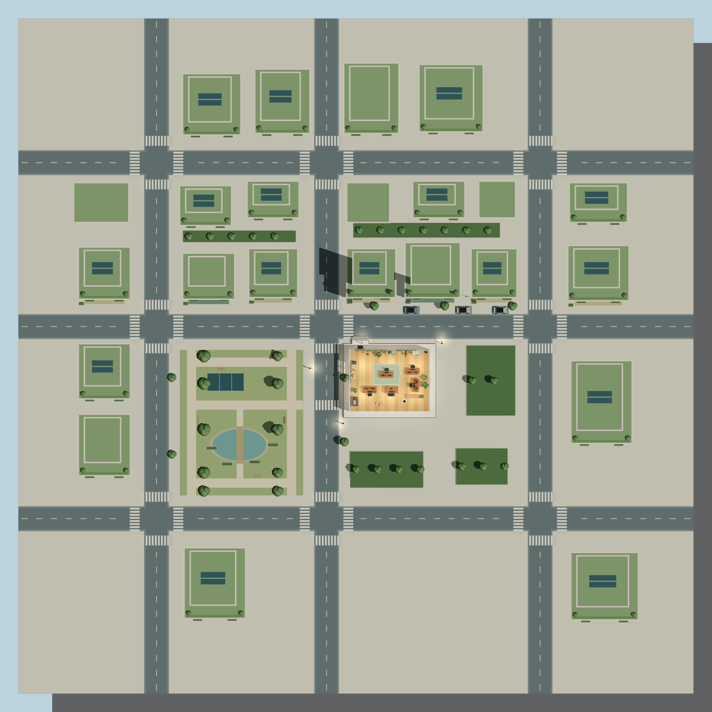 | 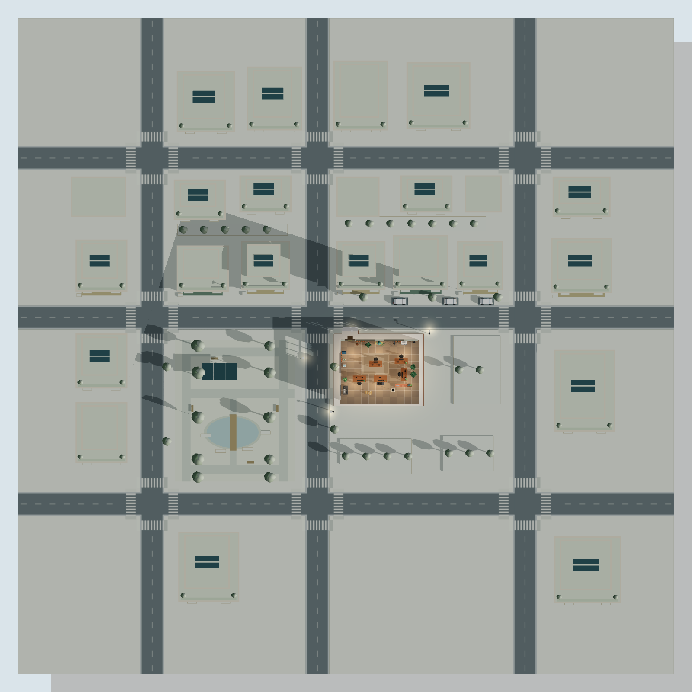 |
| Alder Street · warm wood | Alder Street · winter |

| `tower` | `studio` |
| --- | --- |
| 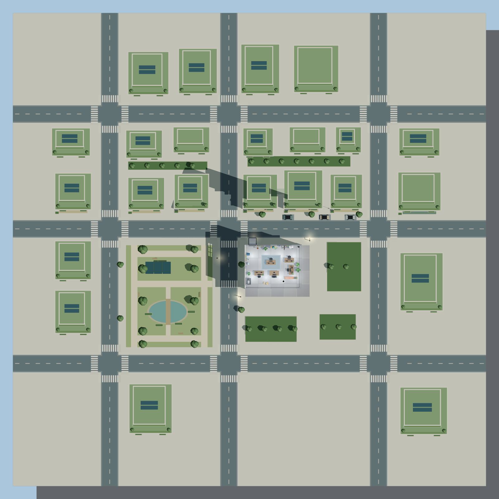 | 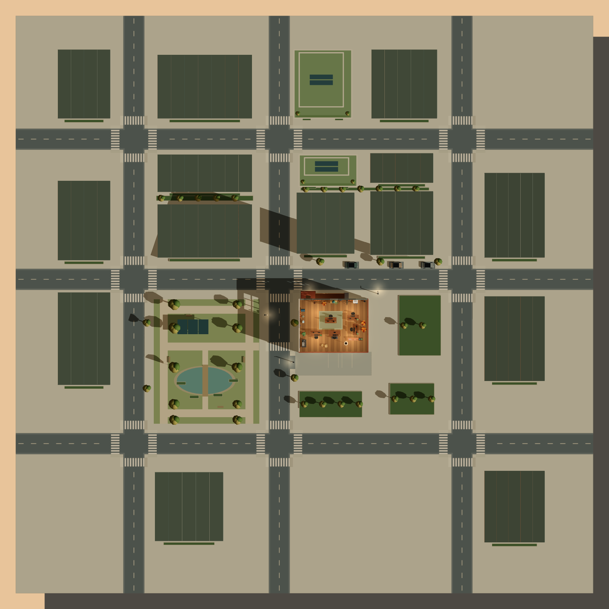 |
| Kestrel Tower · level 34 | Foundry Loft · top floor |

| `tide` | `dune` |
| --- | --- |
| 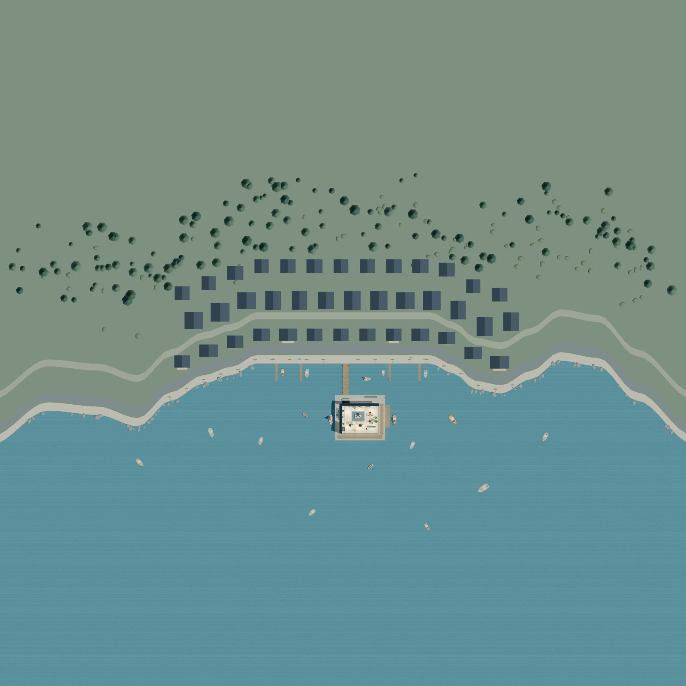 | 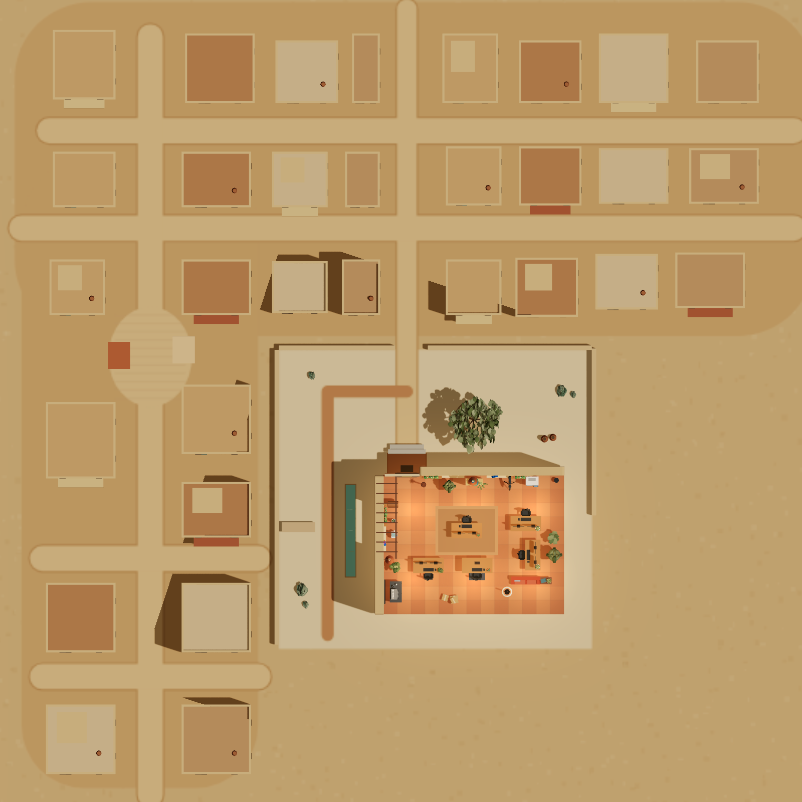 |
| Tide Wharf · the harbour | Dune Atelier · the courtyard |

| `lantern` | `canopy` |
| --- | --- |
| 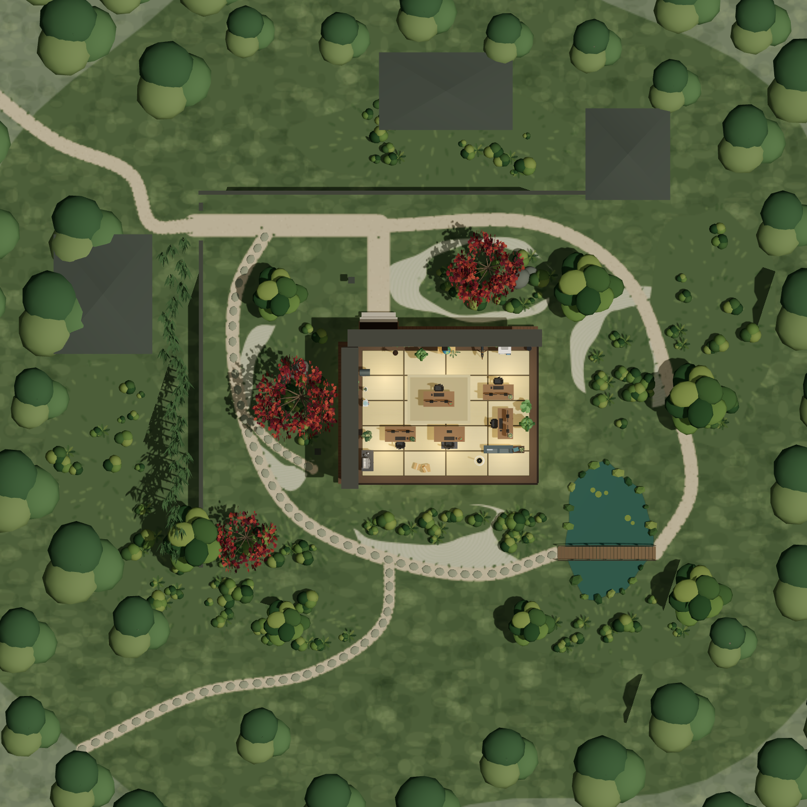 | 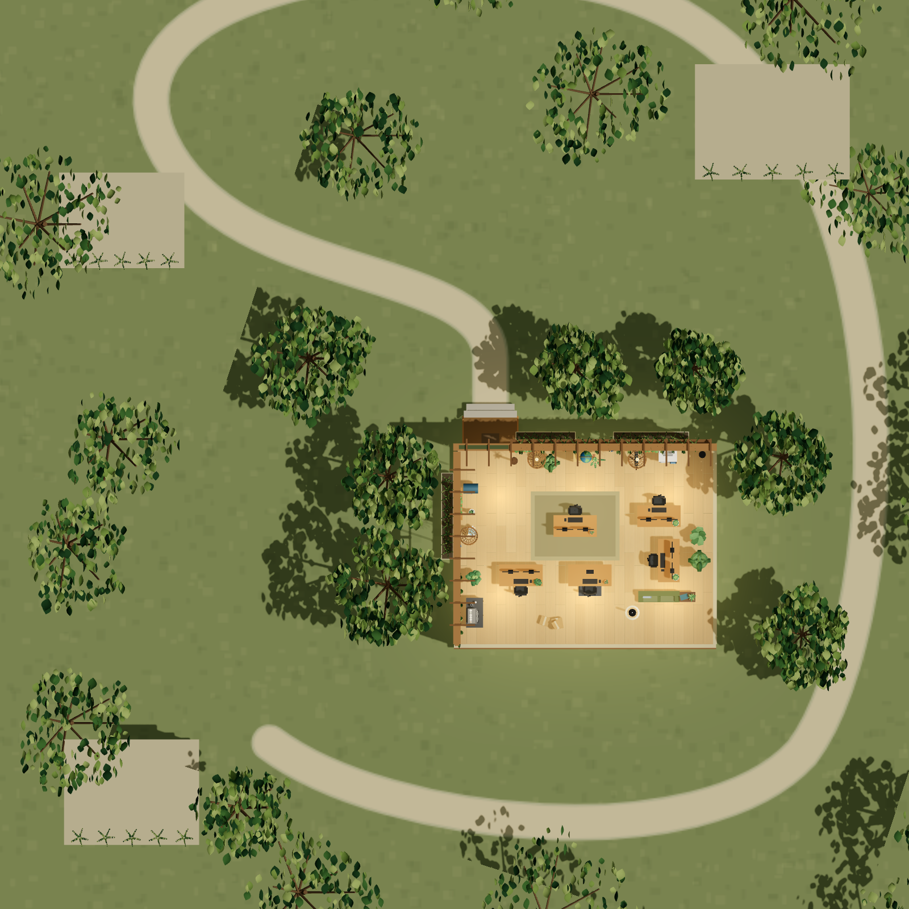 |
| Lantern Court · the garden | Canopy House · among the trees |

Same desks, same rug, same stations, right at the centre of every shot. What changes is
everything around them.

## What is outside is not chosen directly

A theme names a **season** and a **building**, and the outlook falls out of the pair.

Kestrel Tower insists on a skyline however green its season, because a park you are
thirty-four floors above is not a view of a park. Tide Wharf, Dune Atelier, Lantern Court
and Canopy House each force their own — a harbour, a courtyard, a garden. The street-level
brownstone and Foundry Loft take that season's street.

That is why the season and building switches are two independent controls rather than one
long list of every combination — and why a tower's subtitle names no season. Naming one you
cannot see would be a lie.

## What is deliberately not themeable

Room dimensions, station coordinates and the desk layout. Every path an agent walks is
derived from those, so varying them per building would mean re-deriving the pathfinding for
each one. Offices therefore share a floor plan and differ in finish, light and outlook.

They are not un-*editable*, though — [the furniture editor](rearranging-furniture.md) moves
everything at runtime, and that is also what lets a whole room be
[generated from a seed](generated-offices.md).

## Read next

- [Solar geometry](solar-geometry.md) — the light that falls on all eight, and the seasons
- [The room, prop by prop](the-room.md) — what is inside them
- [Generated offices](generated-offices.md) — a whole layout from any string
- Adding a building or a new view outside is a [developer job](../developer/extending.md#add-a-building-or-an-outlook)
