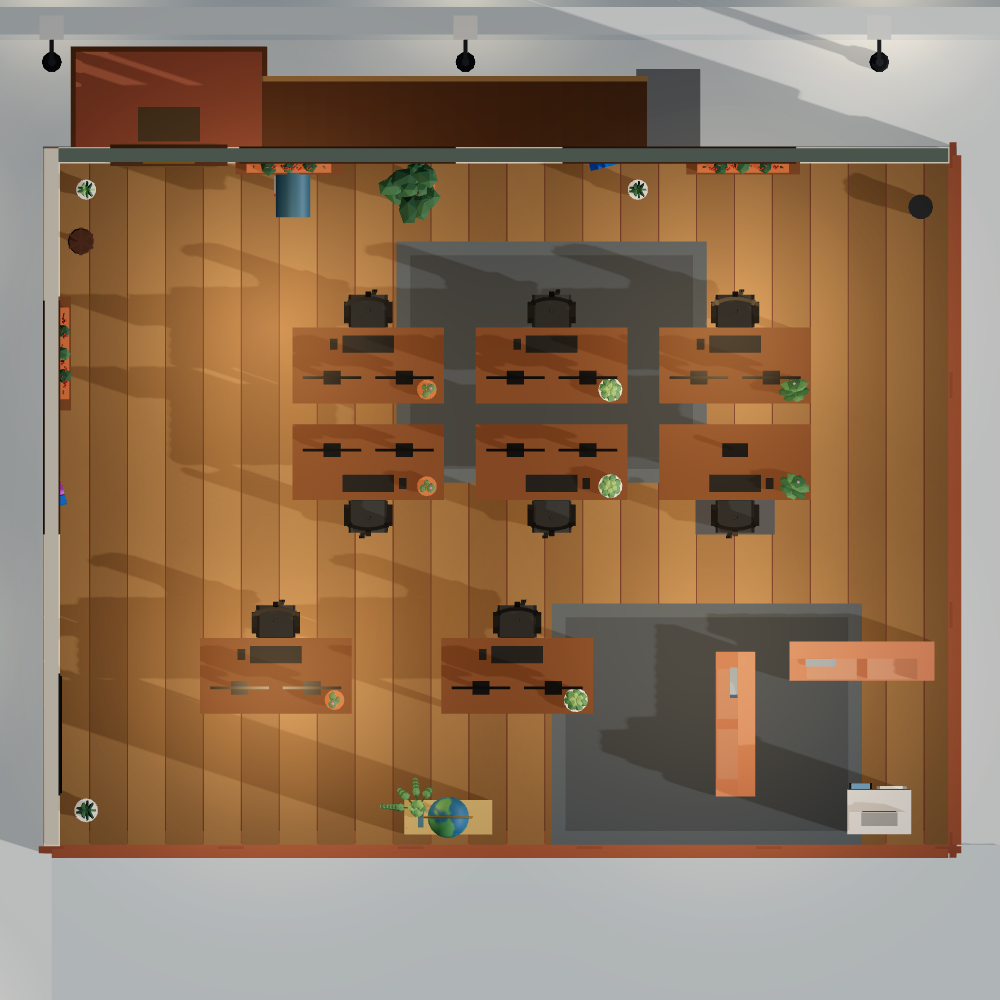
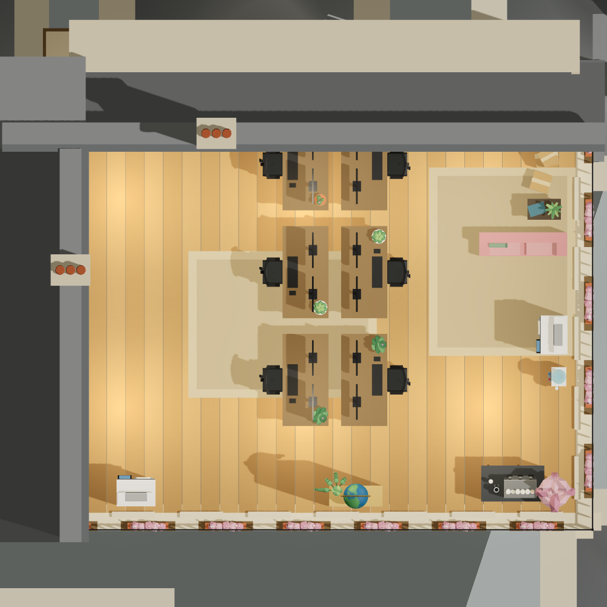
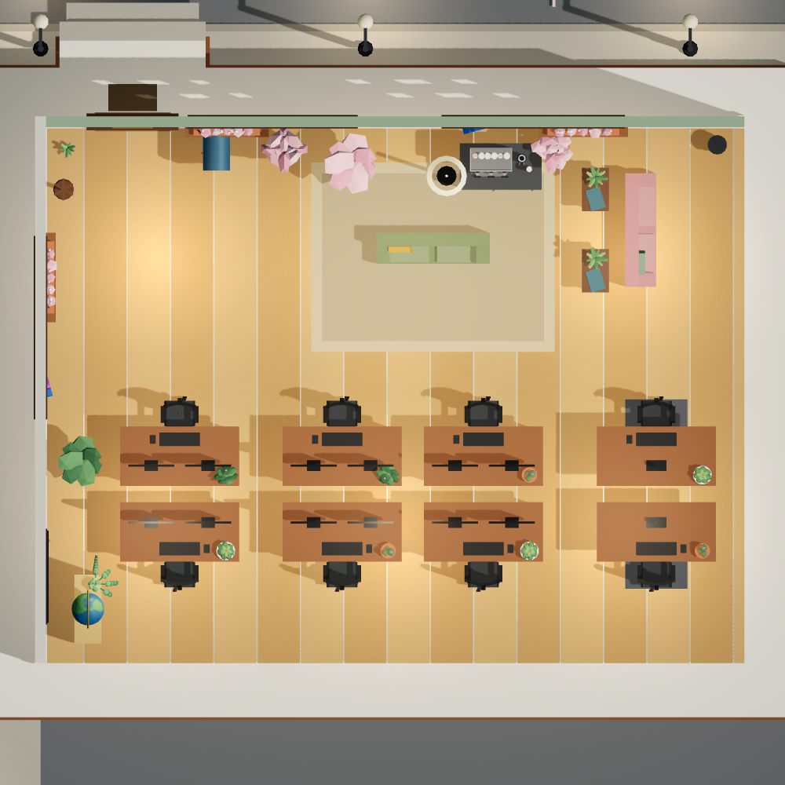
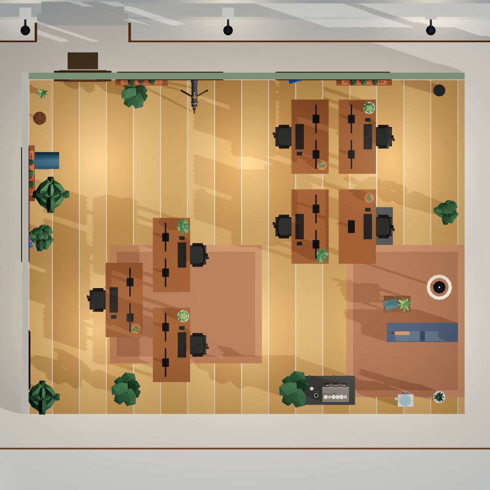

# Generated offices

*A seed is a room. Any string at all, the way any string is a Minecraft world seed.*

`misty-quay-3100` is *Three Blocks*: eight desks in two teams of six and two, one block in
the middle of a warehouse floor, a post box and a
[printer](../item-movements.html#printer), and one warm couch in a big cold room.
**It will always be that office.**

A seed decides how many desks a room has, how they are grouped into teams, which way work
arrives and leaves, where the coffee is, what colour the rug is, what is planted in the
corners, and what the place is called.

The point is not variety. Variety is easy and worth nothing: scatter twenty props at
random and every room is different and none of them is an office. The point is that
**every seed produces a room that works** — desks in teams, aisles that go somewhere, the
noisy machines away from the quiet end, somewhere to do every job the office needs doing,
and nobody stranded behind the furniture.

| | |
| --- | --- |
|  |  |
| **Three Blocks** — `misty-quay-3100`<br>Eight desks in two teams of six and two, one block in the middle of the floor. A post box and a printer, and the courier calls. *Cold Store: one warm couch in a big cold room.* | **The Second Press Room** — `copper-kiln-7220`<br>Six desks in one team, one long back-to-back run down the room. Two printers and a stack of stock, and not a letter in the building. *Rooftop Spring: chimney pots and blossom, everything pale.* |
|  |  |
| **The Brownstone Letterbox** — `gallery-6`<br>Eight desks in two teams of four, off a street across the room. One post box, and no courier. *Blossom Street: pale wood, cherry blossom, everything a shade lighter.* | **Pods and a Lookout** — `sweep-9`<br>Seven desks in two pods, screens meeting in the middle. Lookups go to a telescope at the window. Nine plants, which is as many as the corners will take. *First Frost: a warm room with a cold street through the glass.* |

> These four are **overhead plans** rather than the isometric view the rest of the site
> uses, because a plan is the honest way to show a floor layout. Every name, reason and
> scheme line above is the plan's own — run
> `node bin/office-plan.js misty-quay-3100` and the same words come back. They are not
> maintained by hand on this page, which is how they came to be wrong once already.

**[Two dozen more →](../office-seeds.html)** — a contact sheet with their names, their
reasons and their scorecards, and each one carries an **Open this office** link that mints
a keycard and furnishes the room from that seed. A plan you like is one click from a room
you can walk into.

## Where you meet one

- **A new office.** Open a keycard nobody has used and its first room is generated.
- **New scene** in an office you already have.
- **Random**, in the furniture editor's Layout row (press `E`). It is an ordinary edit, so
  one **⌘Z** puts the previous room back.
- **A seed link** — `/?seed=slate-orchard-2210`, which is what the gallery's links are.

A room is generated **once**, when it is first opened, and never again.

> **The seed is the only way back to a room you liked**, which is why the panel prints it
> on screen rather than tucking it in a log. Press **Random** six times and the five you
> passed over are gone unless you noted their seeds.

The layout picker shows the office's own **name** while you are in it — `The January
Parlour *`. By the letter of the editor's three states a generated room is an edit of the
authored plan and should read `Default *`, but Default is exactly what it is not, and the
whole point of generating a room is that it is a particular room with a particular name.
The tooltip carries the seed.

## What a seed decides

Two stages, and the order is the argument. First a **brief** — what this office wants,
with no idea what will fit — then a **test fit**, which is the brief laid onto the actual
floor. That is the order a space planner works in, and it is why a room may come back with
fewer desks than were asked for and *say so* rather than pretending the brief was
different.

| | |
| --- | --- |
| **Headcount** | 2 to 14 desks, weighted towards the sizes that make a *room*: four to nine is an office you can see the shape of at a glance. |
| **Arrangement** | `rows` · `pods` · `spine` · `perimeter` · `island`. Five, and each is a real arrangement with a real argument for it rather than five ways of scattering furniture. |
| **Teams** | The desks divided into groups that sit together — three to five to a bench, four to six to a pod. This is what makes a pod a pod: a cluster is only a team's cluster if the team is the thing that decided its size. |
| **Sit-stand desks** | Usually one, sometimes none, occasionally two on a big floor. They go to the desks nearest the camera, because a raised top only reads as raised beside a neighbour at ordinary height. |
| **Intake and dispatch** | Seven characters, from a `post-room` to a `paperless` floor with no letterbox at all to a `wharf` with two boxes, a printer and a stack of stock. |
| **Lookups** | A `reference` shelf, a `library` of two, an `observatory` with a telescope and no books, or a `great-library` with both. The shelf answers for what the company knows and the telescope for what is outside the building, which are different questions. |
| **Drinks** | Coffee, water, both, or a dry floor. A room with nothing to drink is a poorer room and a working one. |
| **Lounge** | None, a reading corner, a snug, a parlour, two armchairs, or a proper lounge. |
| **Planting** | Bare to a jungle — nought to nine floor plants. |
| **Colour** | One of sixteen schemes. |

That is on the order of a **billion distinct briefs** before a single thing is placed, and
placement adds more. Measured rather than argued: two thousand seeds produce two thousand
distinct floor plans, no two of them the same room.

## The rules it will not break

Everything is placed the same way: work out every position the piece could stand at, score
them all, and take the best one that does not fence anybody in. The worst that can happen
is that there is nowhere at all — and then the piece is simply not in this office, and the
report says so.

**A generated room is a room somebody could have dragged into place**, because the judge is
the furniture editor's own arithmetic rather than a second copy of it. Nothing arrives
anywhere a drag could not have put it.

Beyond that: nobody may build in the doorway, nothing may stand where a person could not
actually stand, and — the one rule no rectangle can express — **nothing may be put down
that fences anybody in.** A bookcase that overlaps nothing at all can still seal the only
way into the corridor behind a bank of desks, so each piece is checked against every
standing spot already in the room as it goes down.

### The adjacencies, which are the argument

Every station scores on where its *job* wants it, and each rule is one you would recognise
from a real floor plan.

| | |
| --- | --- |
| Printer, coffee machine | **Away from the quiet end.** The two things every space-planning guide names. |
| Bookshelf | **Where the work is.** A shelf is somewhere you go mid-task, so it scores the other way: near the desks, against a wall. |
| Coat stand | **By the door**, because that is what a coat stand is. |
| Post | **Where the post arrives** — near the entrance, or under a window. Both are true here: a parcel comes in through the door and a letter flies in through the glass. |
| Stock | With the post and out of the way. A stack of boxes is furniture you take from, not somewhere anybody queues. |
| Telescope | **At a window**, refused anywhere else. A telescope in the middle of a room is a prop somebody left out. |
| Bin | **In a corner, near the printer** — and never the corner by the door, which is the one corner a bin may not have. |
| Couch, armchairs, table, lamp | **As a group.** The couch goes wherever the room has been left most generous, and everything else is placed against it: a chair within arm's reach, a table at arm's length, a lamp at the end. A chair on its own across the room is not part of the corner the couch makes. |
| Planting | **Corners, edges and window bays**, and this one is a refusal rather than a preference. A plant in the middle of open floor is something somebody left there. In a packed room that means fewer plants than the brief asked for, which is the right answer: the corners are where the plants go, and they are full. |
| Seasonal planting | Out on the open edges and in the window bays, where the street is visible behind them — so when they turn, they turn against a matching season outdoors. The rest of the room stays evergreen, which is what stops February looking dead. |

The desks get three more, all out of the same place in the literature: put the focus zone
where the entrance traffic does not run through it, give the desks the daylight, and hang
them off a circulation lane rather than making people thread between them. Which side of
the street the desks go on is decided by the plainest of the three — **the quiet end is the
end without the door in it.**

## The colour scheme

Most of a room's colour is not the layout's to choose: the walls, the floor finish and the
light come from the building. What a *layout* paints is the rug and the soft furniture, and
those are the two things that have to agree with everything already decided.

So a seed picks a **scheme**: one of sixteen — the whole grid of four buildings by four
seasons — each with the rug and upholstery that go with it, each named for what it is.
*High Summer*, *Long Shadows*, *Cold Store*, *Night Shift*, *Zinc and Limestone*.

The pairs are written down rather than computed, and the reason is worth stating: moss
velvet on stained warehouse boards under an October sun is a scheme, and the same green in
the tower's grey daylight is a mistake. That judgement does not come out of a hue rotation.

A scheme carries a second upholstery colour for its accent, so a room may have a matched
suite or a chair that deliberately does not match. Both are real rooms.

## The name, and the reason

Both are read off the room that was actually **built**, never off the brief that asked for
it — because the floor plate gets a say, and a room called "Four Pods" with three pods in it
is worse than no name at all.

A name is a short phrase about the one or two things that make this office itself: how the
desks are arranged, and whatever is *unusual* about it. **Unusual is the whole test.** Every
office has somewhere for work to arrive, so "post room" says nothing and the room falls back
to being named after its desks; a floor with no letterbox in the building is worth naming
after that fact.

> **The Reading Room** · **Bench Room and an Exchange** · **The Russet Print Shop** ·
> **Pods and a Lookout** · **The Frosted Pod Room** · **The Little Long Room** · **Blocks
> and a Letterbox** · **The Thirty-Fourth Mail Room** · **Benches and a Great Library** ·
> **The Palm Court**

Every word is earned by something in the layout. The adjectives are grouped by what they
are *about*, so a winter scheme may be called cold and a nine-desk floor may be called
great, and neither may borrow the other's word.

Two offices that genuinely are "the frosted pod room" share the name, and that is allowed:
a name describes the room, and those two rooms are the same room in every way a name can
carry. Two thousand seeds come out with 1,185 different names between them, 897 of which
belong to exactly one office. **The seed is the identity; the name is a description.**

The **reason** is the same facts written out, in the order somebody walking in would notice
them:

```
8 desks in two teams of 6 and 2, one block of desks in the middle of the floor,
off a street across the room. Work comes and goes by a post box and a printer,
and the courier calls. Lookups go to a bookshelf. The break end has two things to
sit on, kept away from the quiet desks. Cold Store: one warm couch in a big cold
room.
```

**It cannot flatter the room.** A floor that came out with fewer desks than the brief asked
for says so; a team that ended up with one desk is described as what it is — somebody on
their own at the end of a bank — rather than counted in as a "team of 1", which is the sort
of phrase that tells you a sentence was assembled rather than written.

The name, the seed and the reason all ride inside the layout file, so a generated office
can be exported, pasted, downloaded and saved to your shelf
[like any other layout](layouts.md#four-ways-in-and-out).

## A generated room is just a layout

Nothing about a generated office is special once it exists. It is
[a layout](layouts.md) like any other — rearrange it, save it under a name, export it, send
it to somebody. The seed is only how this one got here.

## Read next

- [Rearranging the furniture](rearranging-furniture.md) — where **Random** lives, and how to
  keep a room you like
- [Buildings and themes](buildings.md) — the shell a generated layout is dressed in
- The gate, the scorecard and the two-thousand-seed sweep are in the
  [developer docs](../developer/layout-algorithm.md)
