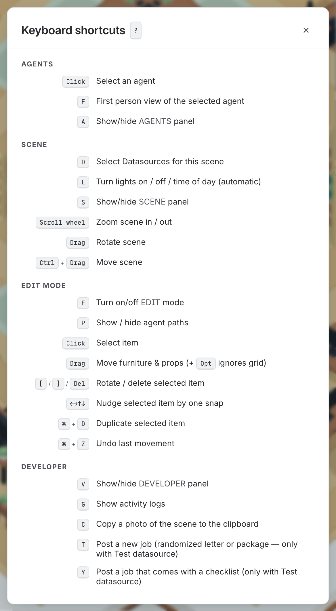

# Keys and panels

*Everything the keyboard does. Press `?` in the app for the same list.*

*Press **`?`** in the office and you get this — the same list as below, generated from the same registry.*

The compact top bar holds your keycard, scene switcher and source picker. Hover over
each control for a tooltip explaining what it does. Press `S`
for the scene controls, `E` for furniture, `A` for the agents roster, or `?` for help.
Select an agent and choose **Follow Along** in their detail panel to see the room from
their shoulder.

## Time of day

The office opens at your local time. Press `S` to open **Scene** and drag the time
slider to explore the day. Choose **Now** to return to your local clock. This
changes the room's lighting; job timestamps still show real time.

## The camera

| | |
| --- | --- |
| **Drag** | Orbit. Clamped in tilt and swing, so it always reads as a diorama rather than a game. |
| **Scroll** | Zoom. |
| **Ctrl/⌘ + drag** | Pan, clamped so the office cannot be shoved off screen. |
| **Click an agent** | Their detail panel: status, current job, and the last ten jobs. |

## The keys

| Key | Does |
| --- | --- |
| `?` | The shortcuts panel. |
| `Esc` | Close the open panel, or drop the selected agent. |
| `D` | **Datasources** — which harnesses fill this office. It can hold several at once. |
| `S` | The scene panel: time-of-day scrubber, lights, season and building. The room's own dials. |
| `L` | Cycle the lights: follow the clock, force on, force off. |
| `A` | Hide the agents roster, which covers the corner the camera usually points at. |
| `F` | Look through the selected agent's eyes. Again to step out. |
| `E` | **Rearrange the furniture** — drag props about and watch the paths re-route. [More](rearranging-furniture.md) |
| `P` | Show or hide the route ribbons: the paths people are walking. |
| `T` | Airmail a job in. Only offered when something selected can invent one. |
| `C` | Copy a photo of the scene to the clipboard — the canvas only, no panels. |
| `G` | The activity log: every event, as text. |
| `V` | The developer panel: camera readout, and the way to the debug log. |

The **Scene** panel adapts to the space beside the other panels. Buildings use two
columns. Time and Season share a section: **Now** sits beside Time, with the scrubber
and a wrapping row of season buttons underneath. The scrubber expands into spare
space. **Auto** lets the clock control the lights; the disabled switch shows whether
they're on. Click Auto again to use the switch yourself. In a narrow panel, the
switch sits underneath Auto.

## Every panel also closes with a click

Each one carries an **×** in its own top-right corner — the strips along the bottom, the
agents roster, the agent detail panel, the shortcuts card, the source picker and the
first-person caption.

A key is a shortcut, not the only door. If you opened a panel by clicking something, you
should not have to learn a key to put it away again. It is the same × everywhere, and it
does whatever the key does rather than merely hiding the panel — Edit Mode's × leaves the
mode, gizmos and route ribbons included.

## The room comes back the way you left it

Put the agents roster away and it stays away. Leave the **Scene** or **Developer** strip
open and it is still open next time. The three panels you can show and hide with `A`, `S`
and `V` are remembered, so an office you have arranged to watch one way does not have to
be rearranged every time you open it.

It is remembered **by this browser**, not by the office — the same as where you left the
camera and the layouts on your shelf. Send somebody your keycard and they get the room,
not your screen; open the same office on your phone and it arranges itself however you
last left it *there*. If your browser will not keep anything — a private window, for
instance — the panels simply open the way they always did.

Two things are deliberately *not* remembered. **Edit Mode** always opens closed, because
it changes what dragging the mouse does and coming back to a room that is already
rearrangeable is a surprise rather than a convenience. And an agent's **detail panel**
needs an agent, so it waits for you to pick one.

## Two keys that behave oddly on purpose

**`T` disappears.** It offers to invent a job, so it is only there when something selected
can actually invent one — Test Data can, a live harness cannot. It vanishes from the
keyboard *and* from the `?` panel in that case, because fabricating work on a live feed
would be the office telling you a lie about your agents.

**`F` is listed even when it does nothing.** It needs an agent selected. The shortcut
stays in the list so you can discover the mode before selecting anyone; **Follow Along**
in the detail panel offers the same view once you do.

## Riding along

**Follow Along** or `F` puts the camera on the selected agent's shoulder. Their head is hidden while you ride,
name tags fade as you get close, and the corners of the screen darken so it reads as
looking *through* somebody rather than at them. Press `F` again to step out.

It is the best way to appreciate that the room is a real space with real distances in it,
and the fastest way to notice that the printer is a head taller than the people using it.
