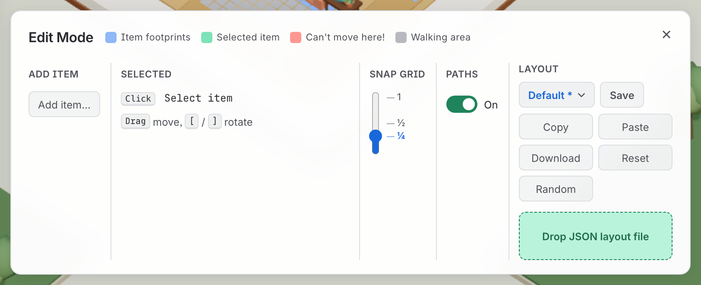

# Layouts

*An arrangement of furniture is a thing in its own right: it is kept, it can be named, and
it can be handed to somebody else as a file.*

*The **Layout** row at the right-hand end is this page: Copy, Paste, Download, Reset, and the picker that names which layout the room is showing.*

Moving the furniture is [rearranging the furniture](rearranging-furniture.md). This is what
happens to the arrangement afterwards.

## Where your arrangement lives

**A layout belongs to a scene**, and is stored with that scene on the server next to its
season and building — so everyone holding the keycard gets the room as you left it. Saving
happens on its own, half a second after you stop.

A scene nobody has rearranged has no layout stored and gets the authored one back. Laying
one room out and looking at it in another building is **Copy** in the first and **Paste** in
the second.

### It moves under everyone at once

A change is pushed to every other tab watching that office. Open the same keycard twice and
drag a desk in one — it moves in the other.

- **It works with edit mode closed**, which is the ordinary case. Somebody watching their
  agents has no idea the editor exists and should still see the desk move.
- **A colleague's change is not on your undo stack.** **⌘Z** is a record of what *you* did,
  and somebody else's change turning up in it would make undo do something nobody could
  predict.
- **Only the layout moves live.** A new season or building is stored and takes effect next
  time the scene is opened — rebuilding the world under somebody standing in it would empty
  the office they were watching in order to redecorate it.
- **The demo office never saves.** Its scenes are shared, so a stranger tidying one would be
  tidying it for everybody. The editor still works there; it just forgets.

## Saved layouts

Copy, Paste, Download, Reset and Random wrap as the **Layout** section narrows,
down to a column of five buttons. Their order stays the same.

The **Layout** section's heading carries a picker, which always names which of three states
the room is in:

| State | Meaning | Save |
| --- | --- | --- |
| **Default** | The authored room, exactly — where Reset lands | Disabled: nothing of yours to save |
| a name | The room is that layout, off this browser's shelf, exactly | Disabled: it is already saved |
| *name* · edited | A change on top of one of those | Enabled |

Which state you are in is **matched from the room itself, never remembered** — five drags
that happen to land back on "Cosy Corner" *are* "Cosy Corner", and one drag away from it
lights Save up.

Hovering a saved layout reveals rename and a trash can that arms on the first press and
fires on the second. Deleting never touches the room, only the shelf.

**That shelf is per-browser and yours alone.** What travels between people is the file: the
name rides inside it, so a **Copy** or a **Download** carries it and a colleague's **Paste**
arrives already called something.

## Four ways in and out

| | To the clipboard | To a file |
| --- | --- | --- |
| Out | **Copy** | **Download** — `cosy-corner.json` |
| In | **Paste** | Drop it on the zone, or click to pick one |

**Neither clipboard direction is guaranteed**, and the panel is honest about it. Both need a
secure context and reading needs permission on top, so when one is shut each refusal names
the other route: a failed Copy says *use Download instead*, a failed Paste says *drop a
`.json` file instead*. A refusal is never silent and never a dead end.

A dropped file that is not a layout is refused in the same words as a clipboard that is not.
The extension is checked only to say something kinder about an obvious mistake — a `.png`
dragged in by accident — never as a gate.

## The file is plain text, and meant to be edited

It says which pieces there are, of what kind, where, and facing which way. No sizes, no
palette. **Paste** is deliberately forgiving, because the whole point of a portable format
is that it gets hand-edited:

- Unknown keys are ignored and missing ones left alone.
- **Every coordinate is clamped into the room.** A desk at `x: 500` is a typo rather than an
  error worth refusing, and the useful response is to put it back inside the walls.
- A facing within half a degree of a right angle is treated as that right angle — both what
  somebody typing `1.57` meant, and what makes a copy/paste round trip exactly lossless.

So a hand-edited file cannot wedge the office, and the worst a bad one can do is put the
furniture somewhere silly — which you can see, and undo.

## An example to take apart

**[example-layout.json](../examples/example-layout.json)** — a real layout, exported from a
real room. Download it, drop it on the editor's drop zone (`E`), and the office rearranges
itself into it.

It is worth opening in a text editor too, because the format is short enough to read in one
go and that is the fastest way to understand what a layout *is*: a list of pieces, their
kind, where they stand, and which way they face. Nothing else. No sizes, no palette, no
room.

Try editing it before you drop it in — move a desk by changing one number, then watch the
routes re-route around where you put it. A coordinate outside the room is
[clamped rather than refused](#the-file-is-plain-text-and-meant-to-be-edited), so you
cannot break anything by guessing.

## Read next

- [Rearranging the furniture](rearranging-furniture.md) — the editor that makes these
- [Generated offices](generated-offices.md) — where **Random** gets a whole layout from
- [Offices, keycards and scenes](offices-and-keycards.md) — a layout belongs to a scene
