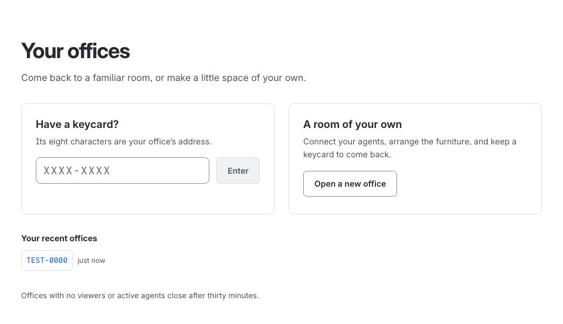

# Offices, keycards and scenes

*How an office is named, shared, and — if you are careless — lost.*



*The [keycard page](https://therovingoffice.com/offices) lets you enter a keycard or open a room of your own.*

## A keycard is the whole address

An office lives at `/office/<keycard>` and is named by that keycard and nothing else. No
login, no account, and no list of offices anywhere. Eight characters:

```
https://therovingoffice.com/office/K7F2-9QBX
```

**Case and hyphens are yours to get wrong.** `k7f2 9qbx` and `K7F29QBX` open the same
office. The alphabet is the digits and A–Z without `I`, `L`, `O` or `U`, so `0`/`O` and
`1`/`I` cannot be confused when a keycard is read aloud or copied off a screenshot — and
dropping `U` means almost nothing rude can be spelled by accident. There are about 1.1
trillion of them, and one is never handed out while it is in use.

Which makes a keycard three things at once:

- **A way in.** Visiting a keycard nobody has used *creates* the office there. A link
  works whether or not anyone has opened it yet, and there is no sign-up step to skip.
- **The only way back.** Nothing lists offices, so the keycard *is* the office. Your
  browser remembers the ones you have visited — on the [keycard
  page](https://therovingoffice.com/offices), and behind the keycard inside any office —
  but that list lives in one browser and nowhere else. Clear your history and the room is
  gone, and so is your ability to close it or change its passcode.
- **Most of the privacy model.** Public to anyone you send it to, invisible to everybody
  else. Two people holding different keycards cannot see each other's agents. If that is
  not enough for a particular room you can put a
  [passcode](sharing-an-office.md#put-a-passcode-on-an-office) on it.

## Click the keycard

The keycard sits at the top left of the office, and clicking it opens everything that is
yours to decide about the room:

- **This office** — the link and **Copy link**. The whole link, not just the code,
  because what you paste into a chat should be something the other person can click.
- **Who is here** — how many people are looking at this office right now, *including
  you*. It counts people rather than connections: reload the page and you are still one
  viewer, and two tabs are two.
- **Passcode** — set one, change it, or take it off again. A padlock appears beside the
  keycard whenever the office has one.
- **Close this office** — take the link back for good.
- **Your offices** — the keycards this browser has been in, newest first. A row marked
  *passcode* is locked; one struck through and labelled *deleted* has gone, and is dropped
  from the list as you watch rather than quietly vanishing — the difference matters,
  because this list is the only record anywhere that your offices exist.

  Two ways out sit under the list, so neither needs a trip back to the keycard page:
  **Open a new office** cuts a fresh keycard and walks you into it, and the field beside
  it takes a keycard somebody sent you. It is the same field as the [keycard
  page](https://therovingoffice.com/offices) — case and hyphens are yours to get wrong
  there too — and **Enter** goes.

**Passcode and Close need the browser that opened the office.** There are no accounts
here, so there is nothing to sign in to: the office remembered itself in the browser that
cut its keycard. Open the same office somewhere else and you can watch it, rearrange it
and connect agents to it, but the passcode and the close button are greyed out with a line
saying why. That is the trade for having no sign-up step — see
[what you give up](sharing-an-office.md#no-accounts-ever).

**An office nobody is watching, with no agents arriving, is deleted after thirty minutes.**
An open tab counts as watching, and so does any event from a harness — so a room being
worked in unobserved is not swept away. The demo office at `/office/TEST-0000` is never
deleted.

## Reception

The front door opens straight into the **demo office**. A small invitation at the
bottom says “Watch. Play. Discover. (You can't break anything) If lost, type `?`”.
Press `?` to see what you can do. The hint fades away after twenty seconds, or you
can dismiss it sooner.

It also gets out of the way the moment you open a panel — Scene, Developer, Edit
Mode, an agent's detail panel, the keycard dialog, the datasources picker or the
shortcuts card. It sits
in the same place as the strips along the bottom, and an invitation printed over the
thing you just opened is no longer an invitation. If a panel is already open when the
office loads — because you left it open last time — the hint does not appear at all.
Dismissing it is for that visit only; open the office again with nothing showing and
it says hello again.

Each visit opens the demo in a **random building and season**, at your local time.
Every browser runs its **own simulated agents**. Furniture, building, season and
lighting experiments affect only your view. Refresh to start fresh with another
random look. The shared starting rooms cannot be renamed, deleted or repointed at
live agents.

Choose **Open your own office** in the scene menu, or visit the
[keycard page](https://therovingoffice.com/offices) for the offices this browser
remembers. Use a personal office to connect real agents and save an arrangement.
When you open one with a new keycard, **Choose sources** appears automatically so
you can select your agents' sources and follow the plugin connection instructions.
It opens once for the new office; press `D` to bring it back later.

## Scenes: one office, several rooms

An office is a set of **scenes**, and a scene is one room: a building, a season, and the
sources filling it. A new office starts with exactly one, its look rolled at random and
its agents simulated, so there is something to look at before you have decided anything.

**New scene** at the foot of the dropdown adds another — again a random building and
season, again full of invented agents. Press `D` or click the pill to point any scene at a
live harness instead.

Hover a scene and you get a pencil and a trash can:

- **The pencil** turns the row into a text field holding the name it was already showing,
  so a name is edited where it is read. **Enter** or a click elsewhere keeps it,
  **Escape** puts it back, and emptying the field hands the scene back to the name its
  feeds imply.
- **The trash can asks first.** The first click arms it, the second removes the room. A
  scene is a set of choices somebody made, and one stray click in a menu is not a way to
  lose them. The last scene has no trash can at all — an office keeps at least one room.

**Scenes are stored with the office, on the server.** Everyone holding the keycard sees
the same rooms; the one *you* were last standing in is remembered by your browser.

**One scene is active at a time.** Switching tears the current room down and builds the
new one, then re-points the panels at the new feed. Your camera framing survives the swap.
Offscreen scenes keep accumulating state, and a second browser window on the same keycard
is how you watch two of them at once.

## A scene is a project, never a harness

Three Rovo CLI terminals open on the same repository are three characters in **one** room.
A Claude Code session in that repository joins them. The harness an agent came from is a
*costume* — a coat colour and a glyph on the name tag — not a building.

Worktrees and branches of one repository collapse into the same room too, because what
identifies a room is the remote. Which branch somebody is on shows up as a detail on that
character instead.

## The demo office says no, politely

`TEST-0000` is shared with everybody and its scenes are authored, so it is not a room to
point at your own agents. Rather than refusing, it redirects: the row at the foot of the
dropdown reads **Open your own office** and cuts you a fresh keycard, and the source
picker shows all the harnesses but disables the ones needing an adapter, with the same
offer as a link.

A control that would not have meant anything is turned into the one that does, instead of
being left there to be clicked at.
