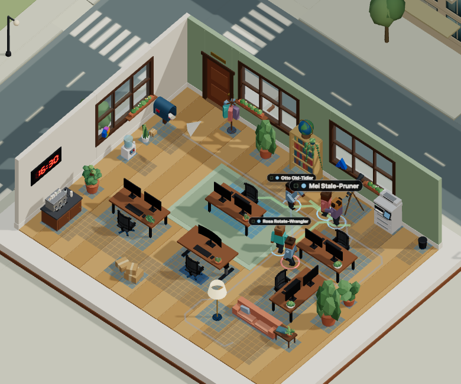
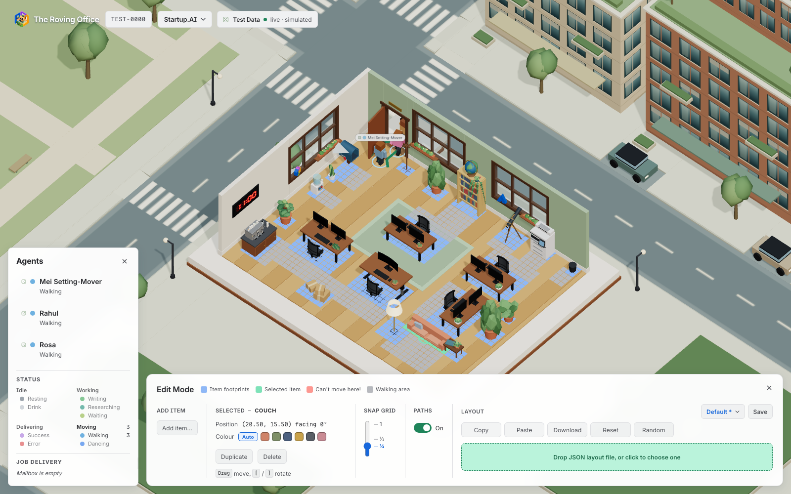

# Rearranging the furniture

*Press `E`, drag the desks about, and watch everybody's route bend round them.*

The office keeps running while you do it. Nothing is paused — agents go on walking,
sitting and fetching coffee while the room changes around them. Freezing would have been
easier and would also have hidden the one thing worth watching, which is the paths
adjusting.

## Driving it

| Key or control | What it does |
| --- | --- |
| **E** | Enter or leave edit mode |
| **Esc** | Leave edit mode |
| Click a prop | Select it. Clicking a monitor selects the whole desk |
| Drag | Move it, snapped. The panel shows live `x, z` |
| Hold **Alt** while dragging | Move it freely, ignoring the snap |
| **[** and **]** | Turn the selection 90°. Nearly everything turns. The floor lamp says it does not — a pole under a round shade looks the same from every side |
| **←** **→** **↑** **↓** | Nudge one snap along the room's own axes — the last few centimetres a drag cannot hit |
| **⌘D** / **Ctrl-D** | Duplicate: the same kind, turned the same way, as near the original as the room allows |
| **⌫** or **Delete** | Take the selection out of the room |
| **P** | Show or hide the route ribbons |
| **⌘Z** / **Ctrl-Z** | Undo, sixty steps deep |
| **Add item…** | What to bring in, under five tabs. [More below](#the-add-item-menu) |
| Swatches | The colours the selection can be painted — the rug, the couch and the armchair |
| Snap scrubber | The grid to snap to, `¼` by default. Three stops, placed at their own values along the track rather than evenly, so the run from `½` to `1` is twice the run from `¼` to `½`. Let go at `¾` and it settles on the nearer stop |
| **Copy** / **Paste** | The layout to and from the clipboard |
| **Download** | The layout as a file, named after it — `cosy-corner.json` |
| Drop zone | Drag a layout `.json` onto it, or click to pick one. Dragged *text* counts too |
| **Reset** | Back to the room as authored |
| **Random** | A whole new office from a fresh seed — desks, teams, stations, lounge, planting and colours, laid out and checked before it arrives. It is an ordinary edit, so **⌘Z** puts the old room back. The panel prints the office's name and its seed, because [the seed is the only way back](generated-offices.md) to a room you liked |

`?edit=1` on the office URL opens edit mode on load:

```
https://therovingoffice.com/office/TEST-0000/?edit=1
```

## What you are looking at

Five overlays, and between them the only answer to "did that actually work?" that does not
involve waiting for an agent to walk past.



*Close up, with the panel out of the way. The blue rectangles are the floor each prop
blocks — **wider than the models look**, which is the surprise — and the pale ribbons are
where people are actually walking. Nobody has stopped working.*



*And the strip along the bottom, which is everything you can do to the room.*

- **Walking areas**, in grey — the standing room people need to use each item.
- **Item footprints**, in blue — the floor occupied by movable props, including
  the clearance they need. These cells match the blue swatch in the legend.
- **A selection ring** under whatever you are holding, tinted green or red by whether you
  may drop it there.
- **The route ahead** of every walker, in green. Drop a desk across somebody's line and the
  ribbon bends round it in the same frame.
- **The route just walked**, in blue, kept after the walk ends and fading out over twenty
  seconds.

**Green is where somebody is going; blue is where they have been.** Routes use
stronger colours than the footprint cells, so they remain visible across rugs and
selected items. The editor's colours stay the same in sunshine and at night.

The blue fades for two reasons: it stops a long session silting up into a cat's cradle of
every journey anybody has made, and since brightness tracks age, a glance says *when*. The
bright blue is the walk that just finished; the faint one is several errands ago.

**Paths** or **`P`** hides the route ribbons for a clearer look at the room, and the preference survives leaving
edit mode and coming back. A toggle that forgets is a toggle you stop trusting.

Worth separating the last two from the first: walking areas say where access is
*possible*, the ribbons say where it is actually *happening*, and those are different
questions. A doorway can be perfectly walkable and still be one nobody's route goes
through any more — which is the kind of thing you want to find out while you are still
moving furniture.

## A drop can be refused

Furniture that overlaps other furniture, leaves the floor, or fences off the coffee machine
is not a layout worth having. So the ring is tinted while you drag, the panel says why, and
a refused drop reverts to where the prop came from.

| The panel says | What is wrong |
| --- | --- |
| `hanging off the floor` | The footprint has left the walkable floor |
| `overlapping desk:desk-4` | The footprint intersects another prop's |
| `nowhere left to stand at it` | Its own approach point is no longer standable |
| `Coffee machine can no longer be reached` | Nobody can get from the door to some station |

**The last one is the one worth having.** It catches the mistake that is invisible while
you are making it: furniture that does not overlap anything and is comfortably on the
floor, but which has quietly walled a station into a pocket nobody can get into.

It only reports what *your* change broke. A room that arrived already stranded — imported,
hand-edited, or saved before a station existed — can still be edited, which is the only way
anybody could fix such a room by hand. It says so in the status line when you open edit
mode.

## The Add-item menu

*ADD ITEM* sits above five tabs — **Furniture**, **Desks**, **Jobs**, **Plants**,
**Other** — and that block does not move: the rows scroll under it, so which tab you are on
is never scrolled away.

**A row is a picture, a name and a plus.** The picture is the prop's own portrait, out of
the same set as the [Item Library](../item-movements.html), so you pick out a side table by looking at one rather
than by reading the words "Side table".

**Choosing one adds it** — at the nearest spot to the middle of the room that the drop
check accepts, turned if that is what fits — and selects it. There is no Add button: there
was nothing else you might have wanted after choosing "Couch" from a menu headed Add item.

**Each required job carries its state.** A chip beside the section heading reads *one needed
✓*, or *one needed — none yet*. Hover it for what covers it. A tab holding a job nobody is
doing wears an amber dot, so the thing wanting attention is visible without opening every
tab to hunt for it.

That chip is why a section can be **empty and still drawn**. A room with its one coat stand
has no coat stand to add, and "one needed ✓" is exactly the useful thing to say in that
space.

**Intake and dispatch wear lozenges**, blue in and green out. The Jobs tab is the only place
a single prop can do *both* — the post does — and the only place the room insists on one of
each.

**Some rows explain rather than add.** The mailbox cannot be added, but it is the thing
doing the job, and the reason there may only be one belongs beside it. The **delivery
person** is there too: he is one of the ways work arrives and is not furniture — no
footprint, nothing to drag, he walks on from off-stage and leaves. A section about how work
arrives that left him out would be telling half the story.

**Two rows are switches rather than items**, in a dashed outline and wearing the same
On/Off switch as Paths along the panel: the delivery person, and the **bird post**. The
bird post's outline holds a little more — a row of species under the switch, in the same
lozenges as Copy and Paste a size down. **Mixed roster** is the shifts as they come
(mostly the owl at night, and you might spot a raven if you look hard); pick a species
instead and every flight is that bird, day and night. Both switches are saved with the
room and undone by **⌘Z** like any other change.

## What the panel tells you about the selection

**Selected** holds everything about the thing you have hold of, with its name in the
heading — `SELECTED – DESK #1`.

Under it: `Position` — `(12.00, 8.00) facing 90°` — then its colours if it has any, its two
buttons, and the keys that apply. That key row is written from the selection: pick the floor
lamp and it reads `Drag move` without the rotate keys.

Select a **desk** and two more rows appear: `Assigned to`, naming whoever works there —
`Ada`, or `No one` — and `Desk marker`, identifying its coloured marker style. A desk is
booked as its occupant walks in and stays theirs until they walk out, so a desk with dark
screens and no chair pulled out may still be somebody's — they are at the coffee machine.
Before deleting a desk, that is exactly what you want to know.

First names only, because the row is two inches wide. `No one` rather than a blank, because
an unclaimed desk is a real answer and a blank reads as the panel not having looked.

## What moves, and what does not

Everything on the floor is draggable, dressing included — twenty-two props in the stock
office. The five desks (each a group: monitors, keyboard, chair, its plant, its seat and
the direction its occupant faces all travel with it), the eight stations, the comfort
furniture, and all five floor plants.

The plants turn too. A plant's footprint is a square either way, so the heading changes
nothing about where people walk — but a monstera's leaves point somewhere, and which way a
fig leans is the difference between a plant in a corner and a plant in the way.

Deliberately **not** movable, each for a reason:

| Not movable | Why |
| --- | --- |
| The wall clock | It is on a wall, not on the floor |
| Window troughs | They sit on the sills, and a sill that moved would leave them in mid-air |
| The logo statues | Same reason — sill objects, not floor furniture |
| Walls, windows, door, floor | Not furniture. The doorway in particular is where the paths reach out to the street |
| The street, the park, the skyline | Not in the room |

## Six rugs, and six sofas

Three kinds have a choice about how they look: six colours for the rug — sage, clay, sand,
slate, plum and ink — and six for the upholstery, shared by the couch and the armchair:
terracotta, moss, navy, mustard, charcoal and blush. They are drawn as swatches rather than
a list of names, because the thing being chosen is a colour and "Plum" is a word you have
to picture.

**The important entry is the first one, Auto**, which is not a colour: it is the absence of
a choice, and it is what everything starts as. A room nobody has asked goes on following
its scene and its season. Choosing a colour overrides that and keeps overriding it, which
is the point of having chosen. It is drawn as a labelled pill rather than an empty swatch,
because an empty swatch reads as a seventh colour — black.

**What is not chosen is derived.** A rug's border is its body a shade darker. A sofa's seat
cushions are its body lifted toward white, and the cushion at your back is an accent chosen
to go with it.

## How many of a thing the room may have

| Kind | How many | Why |
| --- | --- | --- |
| Desks | 1 to 24 | A desk is a seat for one agent |
| Couch, side table, standing desk, floor lamp | 0 to 24 | There is no answer to how many sofas an office should have except however many fit |
| Floor plants | 0 to 24 | A room with no plants is a sadder room and a valid one |
| Bookshelf, telescope | Any number, but at least one *between them* | Looking something up does not have to happen in a particular place. An agent walks to the nearest and uses *that* one |
| Mailbox, inbox | At most 1 each | A room with two outboxes has an unanswerable question about which one the post is in |
| Coffee machine, water cooler, bin, coat stand | At most 1 each | Physically singular, and nothing is gained by a second |
| Printer | Any number | It does real work now, so a second one at the far end of a big room is worth having |

### The minimum is a job, not a kind

The maximum is a question about props. The minimum is a question about **work**. The room
keeps whatever it needs to be able to do four jobs:

| The room must be able to… | Provided today by |
| --- | --- |
| **intake** work | the mailbox, the inbox, the printer |
| **dispatch** finished work | the mailbox, the printer (as a fax) |
| **look things up** | the bookshelf, the telescope |
| **say who is in** | the coat stand |

…and two it can go without: **get a drink** and **throw work away**. A room without them is
a poorer office and a working one — a break happens without a cup, and failed work closes
at the desk instead of being carried to the bin.

What that means in practice:

- **A second of anything frees the first.** Two bookshelves and neither is load-bearing;
  add anything that can deliver and the mailbox is free to leave.
- **A refusal names the job**, not the furniture: *"The office needs somewhere to deliver
  finished work"* rather than *"the office needs its Mailbox"* — which read as arbitrary
  because it was.

The comfort furniture is the exception, and it is worth being clear why nought is safe there
and not for a desk. Nothing walks to a couch out of necessity: resting is an idle pastime,
and an agent who finds every cushion taken goes for a drink instead. An office with no couch
is an office where nobody sits down, which is duller and works. A desk *is* a seat for an
agent, so a room with none is a room nobody can work in.

### The headcount is the desk count

One desk, one agent. **Add a desk and somebody files in to sit at it**; delete one and the
room drains to its new size as shifts end, rather than keeping a crowd standing.

Deleting a desk somebody is *sitting at* is allowed, and worth watching: they stand up where
they were, and if the room has a spare desk they are given it there and then. You can watch
the `Assigned to` row move with them.

If nothing is free they wait, which is honest rather than an oversight — the same state as
an agent who arrived to find every desk taken. They work standing up until one comes free.
Nobody is ever double-booked onto one desk to paper over it.

## Where a new piece lands

Nowhere you chose, which is the one compromise in it: asking for a position would need a
click, and a click in this mode already selects something. So the floor is swept instead,
nearest the middle first, and the piece goes in at the first spot the drop check accepts —
the same check a drag is held to, so nothing can arrive somewhere a drag could not have put
it. Then you drag it where you meant.

A piece gets **turned if that is what fits**. The stock room is tight and a desk is nearly
three units wide, so at a fixed facing there is genuinely nowhere for one.

**Delete a desk, add a desk, and it goes back in the hole** — the spot the last deletion
left is tried before anything else.

A room with no room left says so. Twelve desks, a couch, a rug and seven stations with
walkable standing room at each is about what this floor holds; the thirteenth desk is
refused because every position at every facing either overlaps something, leaves its own
standing room unstandable, or walls something off.

## Saving and sharing what you made

An arrangement is kept with the scene, and it travels: **[layouts](layouts.md)** covers
saving one, sending it to somebody, and the plain-text file it becomes — including
[an example you can download and drop straight back in](layouts.md#an-example-to-take-apart).


## What is not here

Lifting props off the floor, moving wall-mounted or window props, resizing footprints, and
editing the room shell. Also multi-select, dragging a desk with its neighbours, and choosing
*where* a new prop lands rather than taking the first spot that fits.

## Read next

- [Generated offices](generated-offices.md) — where **Random** gets a room from, and why
  every seed produces one that works
- The file format, the sweep, and how to bake a layout into the source are in the
  [developer docs](../developer/editor.md)
