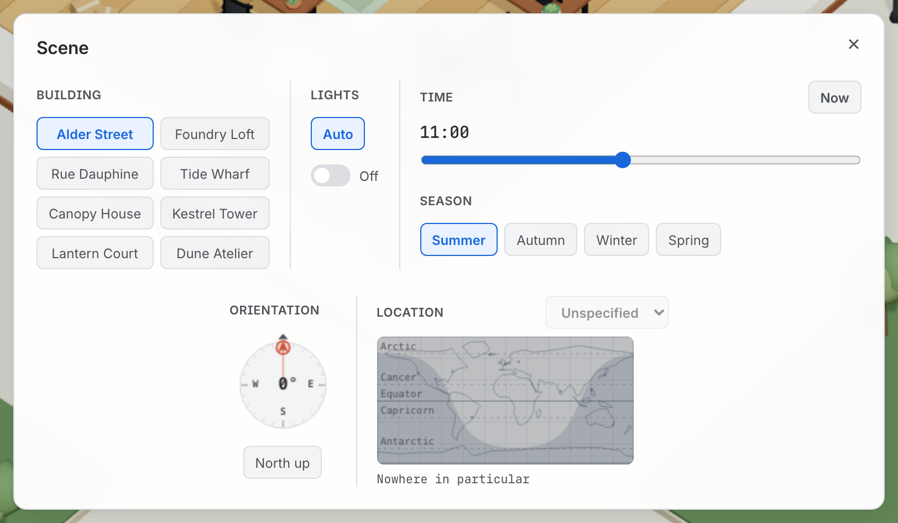

# Solar geometry

*Where the sun is, what season it is, and which way the room faces. The office runs on a
real clock and, if you ask it to, a real place on earth.*

*Press **`S`** for the scene panel. Everything on this page is one of these dials — Time, Season, Orientation, Location and Lights.*

Everything here is on the scene panel (`S`), and none of it needs a rebuild — the Time
scrubber, the Orientation compass, the Location map and the Lights switch all take effect
on the next frame.

## Where the sun is

Height comes from the season and position from the clock: the sun climbs a sine arch from
sunrise to sunset, peaking at whatever that season allows — 62° in summer, 22° in winter —
and sweeps 180° across the same window.

**Orientation**, in the scene panel, is the compass that turns the room under all of that.
It is a compass *card* — the kind that floats in a binnacle — so the card carries the
bearings and turns while the index at the top stays put. North is the red arrow, and the
handle is on it.

It replaced a slider for a reason worth keeping: a bearing is an angle on a circle, 359°
and 1° are two degrees apart, and a track laid out in a line puts them at opposite ends of
the one control that most needs to keep turning.

The same north appears as a small compass in the bottom-right while the room is turned or
the camera swings around it. It combines the room bearing with the camera angle, so it
points at north *on screen* rather than merely repeating the Orientation card. It never
appears over a panel, and once turning settles it fades away.

## Where on earth it is

**Location**, beside Orientation, drops the office somewhere real. Give a scene a latitude
and the sun is worked out from the sky over that latitude instead of the authored arch.

| | London, 51.5°N | Sydney, 33.9°S | Reykjavík, 64.2°N |
| --- | --- | --- | --- |
| Summer noon | 62° up, due **south** | 80° up, due **north** | 49° up, due south |
| Summer day | 03:48–20:12 | 04:52–19:08 | 02:56–23:04 |
| Autumn day | 07:28–16:32 | 06:46–17:14 | 08:32–15:28 |
| Winter day | 08:12–15:48 | 07:08–16:52 | 10:14–13:46 |

A season becomes a position in the year rather than a set of numbers, and the hemisphere
turns it over — so the same **Summer** means June in London and December in Sydney.

**Winter afternoons now end when they really end.** There used to be a fixed 06:00–20:00
window, precisely to prevent that, on the reasoning that a day ending at four reads as a
broken scene. With a real place on the map it reads as Reykjavík, where the sun sets at
13:46 in December and the office finishes the working day under its own lamps. Past the
polar circles the sun stops rising and setting altogether, and both the midnight sun and
the polar night are shown as themselves rather than clamped into a sunrise that never
came.

**Crossing the equator turns the room half a turn.** A northern noon sun is due south and
a southern one due north, so the same room facing the same way is lit from the front on
one side of the equator and from behind on the other — pick Sydney at a bearing that
suited London and the office goes dark, correctly and uselessly. Moving the pin across the
line adds 180° to the orientation, which puts midday back where it was. It is a turn, not
a reset: whatever bearing you chose travels with you, and dragging the pin back turns the
room back.

The clock is read as **local solar time** — noon is the sun on the meridian — so longitude
does not bend the light.

**The map shades its night side, and it moves.** Scrubbing Time walks the band across the
map, and where the pin sits inside it, the office is in the dark. At an equinox the curve
straightens into a pair of meridians, which is what an equinox is.

**It is a sun map, not a world map.** There is no coastline data here and none that could
be fetched, and inventing one would look authoritative and be wrong. What it draws instead
is the lines that decide the light — the equator, the tropics, the polar circles — with a
dozen named places to find a latitude by, which is the job a coastline would have been
doing.

## After dark

The whole rig follows the world clock, so the office lights itself as evening comes in.
The lamps track how *low* the sun is rather than whether it has set, which gives a gradual
dusk instead of a snap.

How many fittings there are is the building's call, since a warehouse and a tower floor
are not lit alike: from the warehouse's four bright industrial pendants to the tower's
eight cool panels, with the brownstone in between. Outside, the street lamps each lay down
a pool of light on the road.

**The ceiling fittings are invisible.** The room is a cutaway with no lid, so housings
would hang boxes in mid-air across your view of the floor. What you see is their effect on
the boards.

The scene panel's **Lights** switch overrides all of it at once. It has three states
rather than being a plain on/off, because the lamps normally follow the clock and a
two-state switch would either lose that or leave no way back to it: `Auto` follows the
clock, `On` and `Off` force it.

## Read next

- [Buildings and themes](buildings.md) — the eight buildings this light falls on
- [The room, prop by prop](the-room.md) — what the light is falling on inside
- [Keys and panels](keys.md) — `S` for the scene panel, `L` to force the lights
