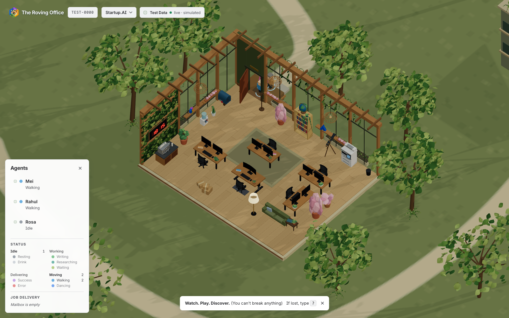

# Watching the office

*For anyone looking at the room. Two minutes, no code.*

---

## What you are looking at

An office. The characters in it are AI agents working in programs like Claude Code or
Cursor — one character per conversation. When an agent starts a piece of work, somebody
sits down at a desk. When it finishes, they get up and post it.

Nothing here is a metaphor you have to decode. The room *is* the status board.

*The room and the panels say the same things. The panels are there for when you want a
name or a timestamp; the room is there for when you just want to glance.*

## What's a job?

**A job is one piece of work.** You asked an agent for something; that's a job. It has
a name, it starts, it ends.

The name is on the desk. It's the first line of what you actually asked for — never a
summary someone invented afterwards.

One job at a time, per person. If an agent is doing six things, that's still one job
with six parts to it.

## How work arrives

Two ways, and **the difference means nothing** — it's just for variety:

- A **[paper plane](../item-movements.html#paperPlane)** flies in through the window.
- A **[courier](../item-movements.html#courier)** pulls up outside and lobs a parcel in through the door.

Either way it lands in the [mailbox](../item-movements.html#mailbox) by the wall. If the [mailbox](../item-movements.html#mailbox) flag is up, there's work
waiting. The window gets twice the share of the other ways in, so most work comes in
over the desks — and about a third of *those* arrive by bird rather than paper plane
(see [Post, parcels and the bin](work-and-post.md#sometimes-the-letter-comes-by-bird)).

Some work has a name on it — a request typed to one particular agent. That plane is
tinted their colour, so you can see across the room who it's for, and only they will
collect it. Unaddressed work goes to whoever gets there first.

## How an agent shows what it's doing

By where it is and what it's holding.

The **Status** legend in the Agents panel groups related activities together.
**Moving** contains **Walking** and **Dancing**, with a count for each. A dancing
agent returns to Idle when the celebration finishes.

| What you see | What it means |
| --- | --- |
| Walking to the mailbox | Fetching new work |
| Sitting at a desk, screens lit | Working |
| At the bookshelf, book in hand | Looking something up |
| Stooped over the telescope at the window | Looking something up *outside* — the web |
| The globe on the shelf turning | The same thing, in a room with no telescope |
| Standing at the coffee machine or cooler | Idling between jobs |
| Carrying a parcel or an envelope | Has work in hand, coming or going |
| Walking to the mailbox holding work | Finished — posting it |
| Feeding a page into the printer | Finished — faxing it out instead, if the machine is nearer |
| Paper stacking up in the printer's output tray | Copies of work the office sent, waiting to be picked up |
| A sheet on the floor by the printer | It overshot the tray. Somebody will get it |
| Crumpling paper into the bin | That job failed |

Coats on the stand by the door are a headcount: one per agent currently in. When
everyone clocks off, the stand is bare.

## How a job ends

**Always somewhere you can see.** Finished work is carried to whichever way out is nearer — the mailbox, or the printer as a fax — and sent.
Failed work gets crumpled up and dropped in the bin.

That's deliberate. If something fails at three in the morning, the crumpled paper is
still in the bin when you look in the morning — and the panel keeps the record. Success
and failure never look the same.

## Reading the room at a glance

A few things worth noticing, because they tell you something a list of rows wouldn't:

- **Work piling up in the mailbox** — jobs are arriving faster than anyone is picking
  them up.
- **Empty desks with the coat stand full** — everyone's in, nobody's working.
- **Somebody who has been sitting there a very long time** — a job that's been open a
  very long time. You notice it without looking for it.
- **A mug on a desk** — they got up mid-job to fetch it. Its colour is the drink.

## Things you can do

Scroll to zoom from the whole office into the details of an individual desk or chair.
Hold **Ctrl**, **⌘** or **Shift** while dragging to bring the object you want into view.

| | |
| --- | --- |
| Click anyone | See their details at the top of the panel, followed by current work and recent jobs |
| **Follow Along** or **F** | Follow Along on the selected agent's shoulder |
| **E** | [Rearrange the furniture](rearranging-furniture.md). The paths re-route as you drag |
| **P** | Show the routes people are walking |
| **?** | [Every other key](keys.md) |

The office holds about a dozen desks. It's a way to watch a team work, not a way to
monitor a fleet.

---

Want the thinking behind it? [Jobs: the one idea](concepts.md) covers the concepts.
