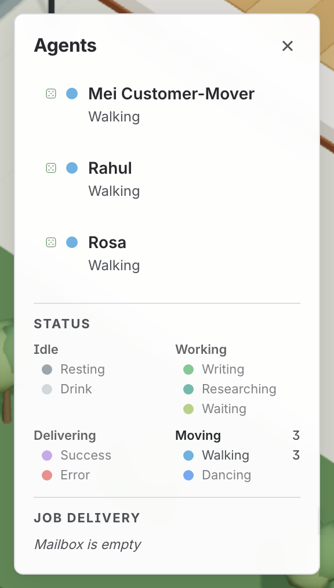

# Post, parcels and the bin

*How work gets into the room, and how it leaves.*

*The **Job Delivery** feed at the bottom of the roster is the written record of everything this page describes.*

Every job you can see in the office arrived as a physical thing and leaves as one. That is
the whole trick: you read the system by looking at where the paper is.

## It arrives two ways, and the difference means nothing

- A **[paper plane](../item-movements.html#paperPlane)** flies in through the window.
- A **[courier](../item-movements.html#courier)** pulls up outside and lobs a parcel in through the door.

Which one you get says nothing about the work — both land in the same [mailbox](../item-movements.html#mailbox), and
both are one job. The variety is there to watch, not to read.

It is not quite a coin toss, though. **The window is drawn twice as often as any other
way in**, because the plane arcing in over the desks is the thing worth watching for.
Whatever else the room has takes an even share of the rest — the courier, and the
[printer](../item-movements.html#printer) if there is one, since a room with a printer can take work in as a fax as
well. So a room with all three is half through the window, a quarter to the door and a
quarter out of the machine; take one away, and the others share what it was getting.

**If the [mailbox](../item-movements.html#mailbox) flag is up, there is work waiting.**

### Sometimes the letter comes by bird

Now and then the window admits a **bird** instead of a plane. It swoops in carrying the
envelope, holds a flutter over the [mailbox](../item-movements.html#mailbox) while the letter drops from its talons, and
flies home. **About one letter in three** takes wing; the rest are paper planes.

Watch it come through the glass: it **folds its wings right back** to fit the pane and
spreads them again once it is inside, which is what a bird crossing a gap actually does
— and it has to, because with its wings out it is wider than the opening. **Only one
bird flies at a time.** Letters that arrive together queue at the window and come in a
flight apart rather than two birds sharing one pane, which never looked like two birds.

**Mostly the owl at night** — three flights in four between 7pm and 7am on the world
clock, so an office watched across dusk changes courier mid-evening. By day the owl keeps
half, and the **carrier pigeon**, **kookaburra** and **raven** share what is left evenly,
so any one of the three is about a flight in six by day and a flight in twelve at night.
You might spot a raven if you look hard. Each carries the beak that names it across the
room — the raven's long straight bill, the pigeon's stub under an orange eye, the
kookaburra's great head and bandit stripe, the owl's hooked nub in a cream face.

It is a second *vehicle*, not a third kind of post. What lands in the box is a letter like
any other — same flag, same envelope in the collector's hand — because how work travels
means nothing, and the bird is only a nicer way for nothing to be meant.

**Which bird flies is yours to choose.** In edit mode, **Add item… → Jobs** has a *Bird
post* switch, and under it a strip of species: **Mixed roster** (the shifts above), or pin
every flight to the **owl**, **pigeon**, **kookaburra** or **raven**. A chosen bird flies
day and night, because the choice is the office's and the clock cannot overrule it. It is
saved with the room, and undoable, like the other switches.

### Some post has a name on it

Work typed at one particular agent is **addressed**. That plane is tinted their colour, so
you can see across the room who it is for, and **only they will collect it** — anybody else
walks past. Unaddressed work goes to whoever gets there first.

### The [courier](../item-movements.html#courier) is not one of your agents

He parks outside, walks two paces into the room, heaves the parcel in, and leaves the way
he came. He wears no name tag and no status ring, because he does not work here. One at a
time, and he takes whichever way in the building has — the stoop, the stairs, or the lift
like everybody else.

## Somebody comes and gets it

Addressed post gets its recipient out of their chair. Unaddressed post is picked up by
whoever is passing.

They check the air first: **a plane still in flight is worth waiting for**, so somebody
who has walked to the mailbox may stand there a moment rather than take the parcel in the
box. If the box holds nothing they are allowed to open, they go to the inbox instead.

Five prompts in five seconds is five trips, in order. Nothing is dropped and nothing is
merged.

## It gets worked on

The desk label is the job's name — the first line of what you actually asked for, never a
summary invented afterwards.

**The label changes when the envelope is opened, not when it arrives.** So there is a
moment where somebody is walking across the room carrying work whose name you cannot see
yet, which is correct: they have not read it either.

Tool calls move them around the room — to the shelf, to the [telescope](../item-movements.html#telescope) — and they always
come back to the same desk, because it is the same job.

> **A new turn is not automatically a new job.** Saying "yes, carry on" continues the job
> already on the desk. It does not summon a new plane.

## It leaves, and always somewhere you can see

**Finished work** is carried to whichever way out is nearer and sent — the mailbox, or the
[printer](../item-movements.html#printer) as a fax. The mailbox flag goes up for five seconds afterwards, which is how you
catch that something *just* went out.

**Failed work** gets crumpled up and dropped in the bin. There is a small pause first,
which is the part worth watching: the job is over before the paper is.

That is deliberate, and it is the most important rule in the room. **Success and failure
never look the same.** If something fails at three in the morning, the crumpled paper is
still in the bin when you look in the morning, and the panel keeps the record. An office
where failure looked exactly like success would be a pretty screensaver.

## The panels keep the receipts

Two feeds run down the side of the agents roster:

- **Job Delivery** — what arrived, and who took it. A coloured dart, a first name and a
  time. Unaddressed post shows the time alone, because there is nobody to name yet.
- **Job Removal** — what left, and how.

The agent detail panel keeps each person's last ten jobs, with their outcome. A job that is
made of several parts shows as `Done (5/5)` and expands.

## Post nobody collects

It stays there. The flag stays up, the parcels stack beside the box, and the pile is the
signal: **work is arriving faster than anyone is picking it up.** Nothing sweeps it away
behind your back.

The machinery of all this — who may open what, what happens when two people reach for the
same parcel, and the handful of places it is still rough — is in the
[developer docs](../developer/job-delivery.md).
